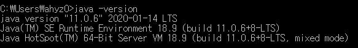
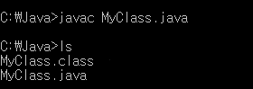
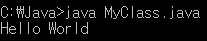

# 1주차 과제: JVM은 무엇이며 자바 코드는 어떻게 실행하는 것인가.


## 1. JVM이란 무엇인가

#### JVM(Java Virtual Machine)

자바 바이트코드``.class``를 OS에 맞게 해석, 실행하는 주체, OS가 이해할 수 있도록 바이트코드를 해석해줌
실행환경(Runtime Environment)의 규격을 제공(필요한 라이브러리 및 기타파일)

**JVM의 특성**

- 플랫폼(OS)에 의존적
- 스택 기반의 가상 머신
- 단일 상속 형태의 객체 지향 프로그래밍을 가상 머신 수준에서 구현
- 포인터를 지원하되 포인터 연산(C와 같이 주소 값을 임의로 조작)이 불가능
- 가비지 컬렉션(Garbage collection) 사용
  * Garbage collection: 메모리 관리 기법 중의 하나로 프로그램이 동적으로 할당했던 메모리 영역 중에서 필요없게된 영역(어떤 변수도 가리키지 않게 된 영역)을 해제하는 기능
- 모든 기본 타입의 정의를 명확히 함으로써 플랫폼 독립성 보장
- 데이터 흐름 분석(data flow analysis)에 기반한 자바 바이트코드 검증기를 통해 스택 Overflow, 명령어 피연산자의 타입 규칙 위반, 필드 접근 규칙 위반, 지역 변수의 초기화 전 사용 등 많은 문제를 실행 전에 검증하여 실행 시 안전을 보장하고 별도의 부담을 줄여줌
- 명령어에서 스택에서 가져올 피연산자의 타입을 명령어에 지정(예: 정수 덧셈은 *iadd*, 단정밀도 실수 덧셈은 *fadd*)


## 2. 컴파일 및 실행 방법

**자바 프로그램을 실행시키는 과정**


> 이미지 출처: https://wikidocs.net/887

**1) 자바 설치**

- command Prompt(cmd.exe)를 실행하여 자바 설치 확인
- cmd에서 `` java -version `` 입력



​	(설치가 제대로 되지 않았다면 [oracle.com](https://www.oracle.com/technetwork/java/javase/overview/index.html) 에서 설치 가능, 설치 방법 및 버전 체크는 다음 링크를 통해 확인)
​	: https://jhnyang.tistory.com/224

**2) 자바 파일 생성**: 사용 가능한 아무 텍스트 에디터를 통해 다음과 같은 자바 파일을 생성, 파일명은 MyClass.java

```java
// MyClass.java
public class MyClass {
  public static void main(String[] args) {
    System.out.println("Hello World");
  }
}
```

**3) 자바 파일 컴파일**

-  cmd에서 자바파일을 생성한 경로로 이동한 후``javac MyClass.java`` 입력, 아래와 같이 ``.class`` 파일이 생성된 것을 확인할 수 있음

  

4) 자바 파일 실행

- cmd에서 ``java MyClass.java`` 실행, 그럼 다음과 같이 Hello World가 출력된 것을 확인할 수 있음




## 3. 바이트코드란 무엇인가

바이트코드(Bytecode)는 고급 언어로 작성된 소스 코드를 가상머신이 이해할 수 있는 중간 코드로 컴파일한 것

자바 바이트코드는 **플랫폼에 독립적**이며, JVM 위에서 OS 상관없이 실행됨


## 4. JIT 컴파일러란 무엇이며 어떻게 동작하는지

**JIT(Just-In-Time)**

실행 시점에 코드를 기계어로 변환하면서(인터프리트방식) 캐시에 저장하여, 재사용할 때 이미 변환된 기계어 코드를 재사용하는 방식

전통적인 컴파일 방식(인터프리트 방식, 정적 컴파일 방식)의 단점을 보완하기 위해 두 가지 방식을 혼합함

- 인터프리트 방식의 단점: 바이트코드나 소스코드를 최적화 과정 없이 번역하기 때문에 **성능이 낮음**
- 정적 컴파일 방식: 실행 전에 무조건 컴파일을 해야하기 때문에 다양한 플랫폼에 맞게 컴파일을 하려면 **시간이 오래 걸림**

JIT는 정적 컴파일러 만큼 빠르면서 인터프러터 언어의 빠른 응답속도를 추구


## 5. JVM 구성 요소

크게 **Class Loader, Runtime Data Areas, Excution Engine** 3가지로 구성되어 있음


> 이미지 출처: https://commons.wikimedia.org/wiki/File:JvmSpec7.png


#### 1) Class Loader

자바 컴파일러를 통해 생성된 바이트 코드(.class)를 엮어 Runtime Data Area 형태로 메모리에 적재하는 역할을 수행

#### 2) Runtime Data Area

**Method Area**

클래스 멤버 변수, 메소드 정보, Type(Class or Interface)정보, Constant Pool, static, final 변수 등이 생성됨, 상수 풀은 모든 Symbolic Reference를 포함

**Heap Area**

동적으로 생성된 오브젝트와 배열이 저장되는 곳으로 Garbage Collection의 대상이 되는 영역

**Stack Area**

지역 변수, 파라미터 등이 생성되는 영역, 동적으로 객체를 생성하면 실제 객체는 Heap에 할당되고 해당 레퍼런스만 Stack에 저장됨. Stack은 스레드별로 독자적으로 가짐

**PC Register**

현재 쓰레드가 실행되는 부분의 주소와 명령을 저장하고 있음(CPU의 Register와 다름

**Native Method Stack**

자바 외 언어로 작성된 네이티브 코드를 위한 메모리 영역

#### 3) Execution Engine

메모리에 적재된 클래스들을 기계어로 변경해 명령어 단위로 실행하는 역할, 인터프리터 방식과 JIT 방식이 있음


**JVM 아키텍처 요약**

- JVM은 Class Loader System을 통해 Class 파일들을 JVM으로 로딩
- 로딩된 Class 파일은 Execution Engine을 통해 해석
- 이렇게 해석된 프로그램은 Runtime Data Areas에 배치되어 실질적인 수행이 이루어짐
- 이 과정에서 필요에 따라 Thread Synchronization과 Grabage Collection을 수행


## 6. JDK와 JRE의 차이

#### **JRE(Java Runtime Environment)**

JRE는 컴파일된 자바 프로그램을 실행시킬 수 있는 자바 환경으로, JVM이 자바 프로그램을 동작시킬 때 필요한 라이브러리 파일들과 기타 파일들을 가지고 있음. JRE는 JVM의 실행환경을 구현

자바 프로그램을 실행시키기 위해서 반드시 필요, 자바 프로그래밍 도구(JDK)는 포함되어 있지 않기 때문에 프로그래밍은 불가함(읽기 가능, 쓰기 불가)


> 이미지 출처: https://wikidocs.net/257


#### **JDK(Java Development Kit)**

JDK는 JRE + 개발을 위해 필요한 도구(javac, java등)들을 포함


> 이미지 출처: https://wikidocs.net/257


**참고 URL**

> - https://ko.wikipedia.org/wiki/%EC%9E%90%EB%B0%94_%EA%B0%80%EC%83%81_%EB%A8%B8%EC%8B%A0
> - https://www.w3schools.com/java/java_getstarted.asp
> - https://medium.com/@lazysoul/jvm-%EC%9D%B4%EB%9E%80-c142b01571f2
> - https://wikidocs.net/257
> - https://velog.io/@litien/JVM-%EA%B5%AC%EC%A1%B0