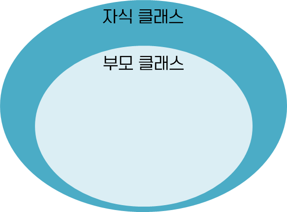
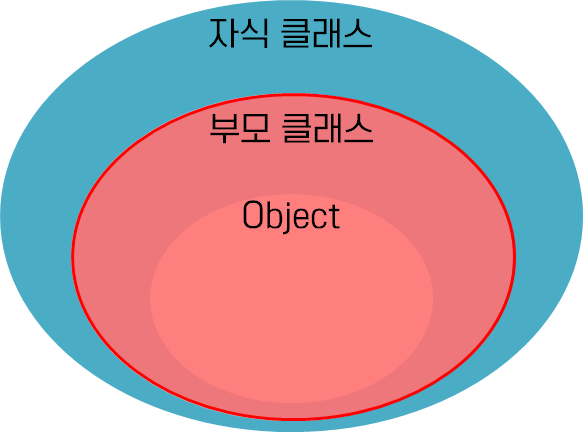
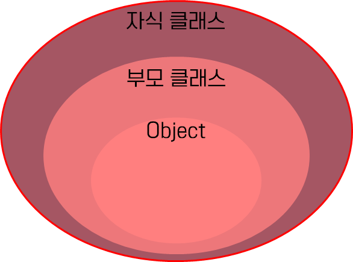

# 3주차 과제: 연산자

### 목표

자바가 제공하는 다양한 연산자를 학습하세요.

### 학습할 것

- 산술 연산자
- 비트 연산자
- 관계 연산자
- 논리 연산자
- instanceof
- assignment(=) operator
- 화살표(->) 연산자
- 3항 연산자
- 연산자 우선 순위
- (optional) Java 13. switch 연산자

---

### 연산자

연산에서 사용되는 표시나 기호


#### 연산자와 연산식에 대한 정리

| 연산자<br />종류 | 연산자                                                 | 연산<br />방향     | 피연산자수     | 산출값<br />타입  | 기능 설명                             |
| ---------------- | ------------------------------------------------------ | ------------------ | -------------- | ----------------- | ------------------------------------- |
| 산술             | +, -, *, /, %                                          | →                  | 이항           | 숫자              | 사칙연산 및 나머지 계산               |
| 부호             | +, -                                                   | ←                  | 단항           | 숫자              | 음수와 양수의 부호                    |
| 문자열           | +                                                      | →                  | 이항           | 문자열            | 두 문자열을 연결                      |
| 대입             | =, +=, -=, *=, /=, %=, <br />&=,^=, \|=, <<=, >>= >>>= | ←                  | 이항           | 다양              | 우변의 값을 좌변의 변수에 대입        |
| 증감             | ++, --                                                 | ←                  | 단항           | 숫자              | 1만큼 증가/감소                       |
| 비교             | ==, !=, >, <, >=, <=, <br />instanceof                 | →                  | 이항           | boolean           | 값의 비교                             |
| 논리             | !, &, \|, &&, \|\|                                     | →<br />*( ! : ← )* | 단항<br />이항 | boolean           | 논리적 NOT, AND, OR 연산              |
| 조건             | (조건식) ? A : B                                       | →                  | 삼항           | 다양              | 조건식에 따라 A 또는 B 중 하나를 선택 |
| 비트             | ~, &, \|, ^                                            | →<br />*( ~ : ← )* | 단항<br />이항 | 숫자<br />boolean | 비트 NOT, AND, OR, XOR 연산           |
| 쉬프트           | >>, <<, >>>                                            | →                  | 이항           | 숫자              | 비트를 좌측/우측으로 밀어서 이동      |

*< 내용 참고 URL: https://medium.com/@katekim720/연산자부터-조건-반복문까지-3d5cec6513d4 >*
(이것이 자바다 | 신용권의 Java 프로그래밍 정복_1 책에서 발췌한 내용인 듯 하다)


연산자는 피연산자의 수에 따라 단항, 이항, 다항 연산자로 구분함

예시)

```java
++x;		// 단항 연산자
x + y;		// 이항 연산자	
(sum > 90) ? "A" : "B";	// 삼항 연산자
```

연산식은 반드시 **하나의 값 만을 산출**함, 연산자 수가 아무리 많아도 두개 이상의 값을 산출하지 않음


## 1. 산술 연산자

산술 연산자는 사칙연산을 다루는 연산자
모두 두 개의 피연산자를 가지는 **이항 연산자**이며, 피연산자들의 결합 방향은 왼쪽에서 오른쪽임

| 산술 연산자 | 설명                                                         |
| ----------- | ------------------------------------------------------------ |
| +           | 왼쪽의 피연산자에 오른쪽의 피연산자를 **더함**               |
| -           | 왼쪽의 피연산자에서 오른쪽의 피연산자를 **뺌**               |
| *           | 왼쪽의 피연산자에 오른쪽의 피연산자를 **곱함**               |
| /           | 왼쪽의 피연산자를 오른쪽의 피연산자로 **나눔**               |
| %           | 왼쪽의 피연산자를 오른쪽의 피연산자로 **나눈 후, 그 나머지를 반환**함 |

```java
class operator_study{
    public static void main (String[] args){
        int num1 = 8, num2 = 4;
        
        System.out.println("num1 + num2 = " + (num1 + num2));
        System.out.println("num1 - num2 = " + (num1 - num2));
        System.out.println("num1 * num2 = " + (num1 * num2));
        System.out.println("num1 / num2 = " + (num1 / num2));
        System.out.println("num1 % num2 = " + (num1 % num2));
    }
}
```

```
<실행 결과>
num1 + num2 = 12
num1 - num2 = 4
num1 * num2 = 32
num1 / num2 = 2
num1 % num2 = 0
```


## 2. 비트 연산자

비트(bit) 단위로 논리 연산을 할 때 사용하는 연산자
비트 단위로 왼쪽이나 오른쪽으로 전체 비트를 이동하거나, 1의 보수를 만들 때도 사용함

| 비트 연산자 | 설명                                                         |
| ----------- | ------------------------------------------------------------ |
| &           | **비트 AND 연산**: 대응되는 비트가 모두 1이면 1을 반환       |
| \|          | **비트 OR 연산**: 대응되는 비트 중에서 하나라도 1이면 1을 반환 |
| ^           | **비트 XOR 연산**: 대응되는 비트가 서로 다르면 1을 반환      |
| ~           | **비트 NOT 연산**: 비트를 1이면 0으로, 0이면 1로 반전 (1의 보수) |
| <<          | **Left shift 연산**: 명시된 수만큼 비트들을 전부 왼쪽으로 이동 |
| >>          | **Right shift 연산**: 부호를 유지하면서 지정한 수만큼 비트를 전부 오른쪽으로 이동 |
| >>>         | 지정한 수만큼 비트를 전부 오른쪽으로 이동, 새로운 비트는 전부 0이 됨 |

```java
class operator_study{
    public static void main (String[] args){
        int num1 = 0b10101;	// 21, 0B는 2진수시작부호
        int num2 = 0b01100;	// 12
        
        System.out.println("num1 & num2 = " + Integer.toBinaryString(num1 & num2));
        System.out.println("num1 | num2 = " + Integer.toBinaryString(num1 | num2));
        System.out.println("num1 ^ num2 = " + Integer.toBinaryString(num1 ^ num2));
        System.out.println("~num1 = " + (~num1));
        System.out.println("~num2 = " + (~num2));
    }
}
```

```
<연산 결과>
num1 & num2 = 100
num1 | num2 = 11101
num1 ^ num2 = 11001
~num1 = -22
~num2 = -13

~num1 = 11111111111111111111111111101010
~num2 = 11111111111111111111111111110011
```

|  A   |  B   | A & B | A \| B | A ^ B |  ~A  |
| :--: | :--: | :---: | :----: | :---: | :--: |
|  1   |  1   |   1   |   1    |   0   |  0   |
|  1   |  0   |   0   |   1    |   1   |  0   |
|  0   |  1   |   0   |   1    |   1   |  1   |
|  0   |  0   |   0   |   0    |   0   |  1   |

|                                                              |                                                              |
| ------------------------------------------------------------ | ------------------------------------------------------------ |
|  |  |
|                                                              |                                                              |
|  |  |

```java
class operator_study{
    public static void main (String[] args){
        int num1 = 0b10101;	// 21, 0B는 2진수시작부호
        
        System.out.println("num1 << 2 = " + Integer.toBinaryString(num1 << 2));
        System.out.println("num1 >> 2 = " + Integer.toBinaryString(num1 >> 2));
        System.out.println("num1 >>> 2 = " + Integer.toBinaryString(num1 >>> 2));
        
        int num2 = 8;
        int num3 = -8;
        
        System.out.println("num2 >>> 2 = " + (num2 >>> 2));
        System.out.println("num3 >>> 2 = " + (num3 >>> 2));
    }
}
```

```
<실행 결과>
num1 << 2 = 1010100
num1 >> 2 = 101
num1 >>> 2 = 101

num2 >>> 2 = 2
num3 >>> 2 = 1073741822
```

shift 연산자를 이용하면 비트가 지정한 자리수만큼 이동

 ``<<``연산자 이용 시 한 비트씩 왼쪽으로 이동할 때마다 값이 2배 증가하며 (2^비트이동횟수)  만큼의 결과 값이 나옴

``>>``연산자 이용 시 한 비트씩 오른쪽으로 이동할 때 마다 값이 2배 감소하며 (2^-(비트 이동 횟수)) 만큼의 결과 값이 나옴


## 3. 관계 연산자

비교 연산자라고도 하며 피연산자 사이의 상대적인 크기를 판단하는 연산자
관계 연산자는 왼쪽의 피연산자와 오른쪽의 피연산자를 비교하여, 어느쪽이 더 크고 작은지 또는 같은지를 판단함
관계 연산자는 모두 두 개의 피연산자를 가지는 이항 연산자이며, 결합 방향은 왼쪽에서 오른쪽임
관계연산자의 결과는 true 혹은 false 값인 boolean 자료형으로 반환됨

| 관계 연산자 | 설명                                                         |
| ----------- | ------------------------------------------------------------ |
| ==          | 왼쪽의 피연산자와 오른쪽의 피연산자가 **같으면 참**을 반환   |
| !=          | 왼쪽의 피연산자와 오른쪽의 피연산자가 **다르면 참**을 반환   |
| >           | 왼쪽의 피연산자가 오른쪽의 피연산자보다 **크면 참**을 반환   |
| >=          | 왼쪽의 피연산자가 오른쪽의 피연산자보다 **크거나 같으면 참**을 반환 |
| <           | 왼쪽의 피연산자가 오른쪽의 피연산자보다 **작으면 참**을 반환 |
| <=          | 왼쪽의 피연산자가 오른쪽의 피연산자보다 **작거나 같으면 참**을 반환 |

```java
class operator_study{
    public static void main (String[] args){
        int num1 = 10;
		int num2 = 5;

		System.out.println("num1 == num2 : " + (num1 == num2));
		System.out.println("num1 != num2 : " + (num1 != num2));
		System.out.println("num1 > num2 : " + (num1 > num2));
		System.out.println("num1 >= num2 : " + (num1 >= num2));
		System.out.println("num1 < num2 : " + (num1 < num2));
		System.out.println("num1 <= num2 : " + (num1 <= num2));
    }
}
```

```
<실행 결과>
num1 == num2 : false
num1 != num2 : true
num1 > num2 : true
num1 >= num2 : true
num1 < num2 : false
num1 <= num2 : false
```


## 4. 논리 연산자

논리 연산자는 주어진 논리식을 판단하여, 참(true)과 거짓(false)을 결정하는 연산자
AND 연산과 OR 연산은 두 개의 피연산자를 가지는 이항 연산자이며, 결합 방향은 왼쪽에서 오른쪽임
NOT 연산자는 피연산자가 단 하나뿐인 단항 연산자이며, 결합방향은 오른쪽에서 왼쪽임

| 논리 연산자 | 설명                                                         |
| ----------- | ------------------------------------------------------------ |
| &&          | **논리 AND 연산**: 논리식이 모두 참이면 참을 반환            |
| \|\|        | **논리 OR 연산**: 논리식 중에서 하나라도 참이면 참을 반환    |
| !           | **논리 NOT 연산**: 논리식의 결과가 참이면 거짓을, 거짓이면 참을 반환 |

논리 연산자의 연산 결과

| A     | B     | A && B | A  \|\| B | !A    |
| ----- | ----- | ------ | --------- | ----- |
| true  | true  | true   | true      | false |
| true  | false | false  | true      | false |
| false | true  | false  | true      | true  |
| false | false | false  | false     | true  |

```java
class operator_study{
    public static void main (String[] args){
        int n1 = 10;
		int n2 = 5;

		boolean result1 = ((n1 > 0) && (n1 < 10));	// false
		boolean result2 = ((n2 > 0) && (n2 < 10));	// true

		System.out.println("n1 = "+n1+ ", n2 = "+n2+"인 경우");
		if ( result1 && result2 ){
			System.out.println(n1 + "과 " + n2 + "는 모두 1과 9사이의 숫자입니다.");
		} else {
			System.out.println(n1 + "과 " + n2 + " 모두 1과 9사이의 숫자가 아닙니다.");
		}

		if( result1 || result2 ){
			System.out.println(n1 + "과 " + n2 + "둘 중에 하나는 1과 9사이의 숫자입니다.");
		} else {
			System.out.println(n1 + "과 " + n2 + "둘 중에 어느 것도 1과 9사이의 숫자가 아닙니다.");
		}
    }
}
```

```
<실행 결과>
n1 = 10, n2 = 5인 경우
10과 5 모두 1과 9사이의 숫자가 아닙니다.
10과 5둘 중에 하나는 1과 9사이의 숫자입니다.
```


***************시간을 측정해보자***************

#### && 와 &의 차이 

자바에는 논리연산자 AND가 &&와 &가 두 개 있다고 한다.

둘의 차이는 피연산자를 모두 참고하는지 아닌지의 여부에 따라 다르다고 함

예를 들어 A가 false이고 B가 true인 경우, ``A & B`` 에서 &연산자는 A가 false라 할지라도 B가 어떤 값을 가지고 있는지 판단을 하기 위해 연산을 수행함

하지만, ``A && B``에서 &&연산자는 A가 false이기 때문에 그 뒤에 B가 true인지 false 인지 판단을 하지 않음(단축 평가)

이와 비슷하게 ``||``연산자는 앞에 오는 피연산자가 true인 경우(``B || A ``), 연산자 뒤에 있는 값이 무엇인지 판단하지 않는다고 함

``` java
class operator_study{
    public static void main (String[] args){
        int a = 1;
		int b = 2;

		if ( (a = 4+4)<0 && (b = 3+3)>0){			// b=3+3 연산을 수행하지 않음
			System.out.println("a= "+a+ " ,b= "+b);
		} else {
			System.out.println("a= "+a+ " ,b= "+b);
		}

		if ( (a = 4+4)<0 & (b = 3+3)>0){			// b=3+3 연산을 수행함
			System.out.println("a= "+a+ ", b= "+b);
		} else {
			System.out.println("a= "+a+ ", b= "+b);
		}
    }
}
```

```
<실행 결과>
a= 8, b= 2
a= 8, b= 6
```

``&&`` 연산을 사용했을 때는 ``(a = 4+4)<0`` 연산의 결과 값이 false이기 때문에 ``(b = 3+3)>0`` 연산을 수행하지 않아 b의 값이 2로 출력 되었음

하지만 ``&`` 연산을 사용한 경우에는 앞의 연산 결과 값이 false라 할지라도 그 뒤의 논리식을 판단하기 때문에``(b = 3+3)>0`` 연산을 수행하여 b의 값이 6으로 출력 되었음

두 논리 연산자의 차이를 이해하고 활용한다면 다양한 결과를 도출할 수 있다고 함


## 5. instanceof

instanceof 연산자는 참조 변수가 참조하고 있는 인스턴스의 실제 타입을 반환해 줌
즉, 해당 객체가 어떤 클래스나 인터페이스로부터 생성되었는지 판별해주는 역할

참조 변수가 형 변환이 가능한 타입인지 연산함
형 변환이 가능하면 true를 반환하며 불가능하면 false를 반환

```java
class operator_study{
    public static void main (String[] args){
        B b = new B();

		if ( b instanceof Object){
			System.out.println("형변환 가능");
		}
	}
}
class B{
}
```

```
<실행 결과>
형변환 가능
```

#### 부모 클래스 참조 변수 instanceof 연산

여기서 상속이란 개념을 알고 넘어가야 하는데, 상속은 기존의 클래스에 기능을 추가하거나 재정의하여 새로운 클래스를 정의하는 것임

**부모 클래스**란 기존의 정의되어 있는 클래스이며, 부모 클래스를 상속을 하여 새롭게 작성한 클래스를 **자식 클래스**라고 함



``` java
class operator_study{
    public static void main (String[] args){
		A a = new A();

		if ( a instanceof Object){
			System.out.println("오브젝트 클래스 형변환 가능");
		}
		if ( a instanceof A){
			System.out.println("자신 클래스 형변환 가능");
		}
		if ( a instanceof B){
			System.out.println("자식 클래스 형변환 가능");
		}
	}
}
class A{	// 부모 클래스
}
class B extends A{	// 자식 클래스
}
```

```
<연산 결과>
오브젝트 클래스 형변환 가능
자신 클래스 형변환 가능
```



부모 클래스로부터 나온 인스턴스가 형 변환이 가능한 것은 위의 그림과 같이 부모클래스 벤다이어그램에 포함되어 있는 부분만임

```java
class operator_study{
    public static void main (String[] args){
		B b = new B();

		if ( b instanceof Object){
			System.out.println("오브젝트 클래스 형변환 가능");
		}
		if ( b instanceof A){
			System.out.println("부모 클래스 형변환 가능");
		}
		if ( b instanceof B){
			System.out.println("자신 클래스 형변환 가능");
		}
	}
}
class A{	// 부모 클래스
}
class B extends A{	// 자식 클래스
}
```

```
<연산 결과>
오브젝트 클래스 형변환 가능
부모 클래스 형변환 가능
자신 클래스 형변환 가능
```



자식 클래스로부터 나온 인스턴스는 자식클래스에 포함된 범위인 모든 타입들로 형 변환이 가능한 것을 확인할 수 있음


## 6. assignment(=) operator (대입)

대입 연산자는 변수에 값을 대입할 때 사용하는 이항 연산자이며, 피연산자들의 결합 방향은 오른쪽에서 왼쪽임

자바에서는 아래 표와 같이 대입연산자와 다른 연산자를 결합하여 만든 다양한 복합 대입 연산자를 제공함

| 대입 연산자 | 설명                                                         |
| :---------: | ------------------------------------------------------------ |
|      =      | 왼쪽의 피연산자에 오른쪽의 피연산자를 대입                   |
|     +=      | 왼쪽의 피연산자에 오른쪽의 피연산자를 더한 후, 그 결과값을 왼쪽의 피연산자에 대입 |
|     -=      | 왼쪽의 피연산자에 오른쪽의 피연산자를 뺀 후, 그 결과값을 왼쪽의 피연산자에 대입 |
|     *=      | 왼쪽의 피연산자에 오른쪽의 피연산자를 곱한 후, 그 결과값을 왼쪽의 피연산자에 대입 |
|     /=      | 왼쪽의 피연산자를 오른쪽의 피연산자로 나눈 후, 그 결과값을 왼쪽의 피연산자에 대입 |
|     %=      | 왼쪽의 피연산자를 오른쪽의 피연산자로 나눈 후, 그 나머지를 왼쪽의 피연산자에 대입 |
|     &=      | 왼쪽의 피연산자를 오른쪽의 피연산자와 비트 AND 연산 후, 그 결과값을 왼쪽의 피연산자에 대입 |
|     \|=     | 왼쪽의 피연산자를 오른쪽의 피연산자와 비트 OR 연산 후, 그 결과값을 왼쪽의 피연산자에 대입 |
|     ^=      | 왼쪽의 피연산자를 오른쪽의 피연산자와 비트 XOR 연산 후, 그 결과값을 왼쪽의 피연산자에 대입 |
|     <<=     | 왼쪽의 피연산자를 오른쪽의 피연산자만큼 왼쪽 시프트한 후, 그 결과값을 왼쪽의 피연산자에 대입 |
|     >>=     | 왼쪽의 피연산자를 오른쪽의 피연산자만큼 부호를 유지하며 오른쪽 시프트한 후, 그 결과값을 왼쪽의 피연산자에 대입 |
|    >>>=     | 왼쪽의 피연산자를 오른쪽의 피연산자만큼 부호에 상관없이 오른쪽 시프트한 후, 그 결과값을 왼쪽의 피연산자에 대입 |

```java
class operator_study{
    public static void main (String[] args){
        int n1 = 7, n2 = 7, n3 = 7;

		n1 = n1 - 3;
		n2 -= 3;
		n3 =- 3;

		System.out.println("n1, n2, n3 = 7 일 때 연산결과");
		System.out.println("- 연산자에 의한 결과 : "+ n1);
		System.out.println("-= 연산자에 의한 결과 : "+ n2);
		System.out.println("=- 연산자에 의한 결과 : "+ n3);
    }
}
```

```
<연산 결과>
n1, n2, n3 = 7 일 때 연산결과
- 연산자에 의한 결과 : 4
-= 연산자에 의한 결과 : 4
=- 연산자에 의한 결과 : -3
```

위의 예시에서 ``n3 =- 3`` 연산은 단순히 -3을 변수 n3에 대입하는 연산이 되었음. 이와 같이 복합 대입 연산자에서 연산자의 순서는 매우 중요하므로 주의를 기울여야 함


## 7. 화살표(->) 연산자


## 8. 3항 연산자

삼항 연산자는 자바에서 유일하게 피연산자를 세 개나 가지는 조건 연산자임

**``조건식 ? 피연산자1 : 피연산자2``**와 같이 사용하며, 물음표 앞의 조건식에 따라 결과값이 true면 피연산자1을 반환하고, false면 피연산자2를 반환함

```java
class operator_study{
    public static void main (String[] args){
        // 삼항 연산자 사용
        int n1 = 5, n2 = 7;
		int result1, result2;

		result1 = (n1 - n2 > 0) ? n1 : n2;

		System.out.println("두 정수 중 더 큰 수는 " + result1 + "입니다.");
		
        // if - else문 사용
		if ( n1-n2 > 0 ){
			result2 = n1;
		} else{
			result2 = n2;
		}
		System.out.println("두 정수 중 더 큰 수는 " + result2 + "입니다.");
    }
}
```

```
<연산 결과>
두 정수 중 더 큰 수는 7입니다.
두 정수 중 더 큰 수는 7입니다.
```

위의 코드와 같이 삼항연산자를 if-else문으로 바꾸어 이용할 수 있음. 삼항연산자는 if-else문 보다 코드 라인이 간결해진다는 장점이 있음

하지만, 삼항연산자를 사용하여 코드의 라인이 줄어들었다고 컴파일 속도가 빨라지는 것이 아니며, 삼항 연산자를 중복으로 사용할 경우 가독성이 떨어질 수 있으므로 주의하는 것이 좋음


## 9. 연산자 우선 순위

연산자의 우선 순위는 수식 내에 여러 연산자가 함께 등장할 때, 어느 연산자가 먼저 처리될 것인가를 결정함

앞서 확인한 연산자들의 우선 순위는 다음과 같다.

| 우선순위 |           연산자           | 결합방향 |
| :------: | :------------------------: | -------- |
|    1     |         (), [], .          | →        |
|    2     |           ++, --           | **←**    |
|    3     | !, ~, +, -, ++, --, (타입) | **←**    |
|    4     |          *, /, %           | →        |
|    5     |            +, -            | →        |
|    6     |        <<, >>, >>>         | →        |
|    7     |  <, <=, >, >=, instanceof  | →        |
|    8     |           ==, !=           | →        |
|    9     |             &              | →        |
|    10    |             ^              | →        |
|    11    |             \|             | →        |
|    12    |             &&             | →        |
|    13    |            \|\|            | →        |
|    14    |            ? :             | ←        |
|    15    | = (그 외 복합 대입 연산자) | ←        |


## 10. optional) Java 13. switch 연산자


### 참조 URL

---

> http://www.tcpschool.com/java/java_operator_arithmetic
>
> https://medium.com/@katekim720/연산자부터-조건-반복문까지-3d5cec6513d4
>
> https://zion830.tistory.com/34 (비트단위 출력)
>
> https://velog.io/@foeverna/Java-연산자-관계-논리-조건-비트-연산자
>
> https://blog.naver.com/ksseo63/221996960575
>
> https://blog.naver.com/rwans0397/220602620066


