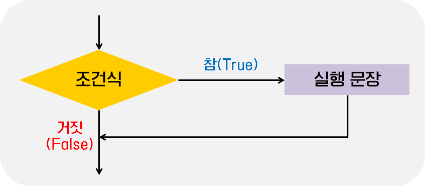
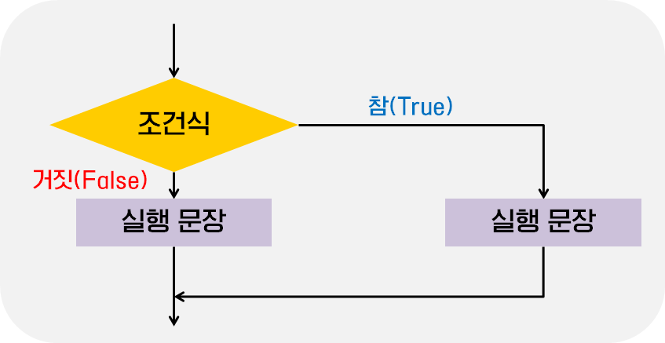
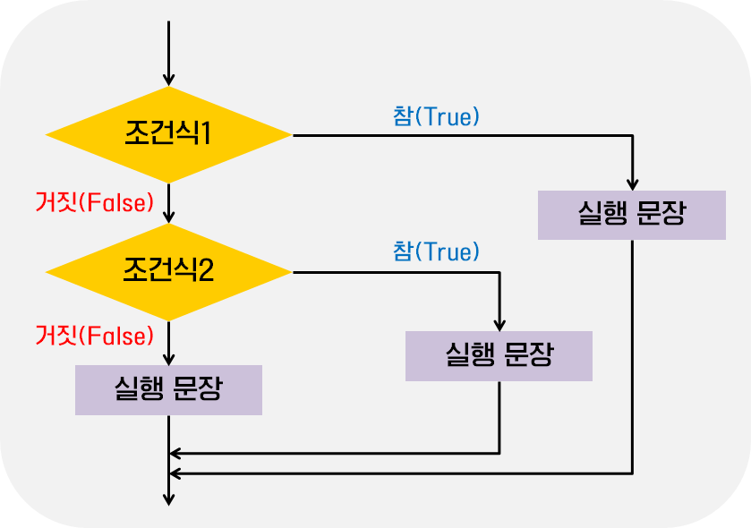
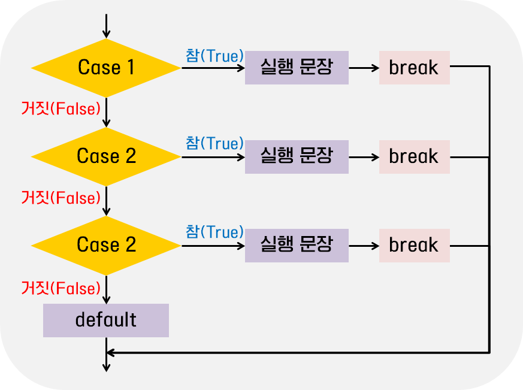

# 4주차 과제: 제어문

### 목표

자바가 제공하는 제어문을 학습하세요.

### 학습할 것

선택문
반복문


## 제어문

코드의 순차적인 흐름을 제어하는 명령문


## 조건문

주어진 조건식의 결과에 따라 별도의 명령을 수행하도록 제어하는 명령문


### if 문

조건식의 결과가 참(true)이면 주어진 명령문을 실행하며, 거짓(false)이면 아무것도 실행하지 않는다.



```
<문법>
if (조건식) {
	조건식의 결과가 참일 때 실행할 명령문;
}
```

```java
public class Main {
    public static void main(String[] args) {
        char ch1 = 'B';
        char ch2 = 'd';

        if (ch1 >= 'a' && ch1 <= 'z') {
            System.out.println("ch1은 소문자 입니다.");
        }
        if (ch2 >= 'a' && ch2 <= 'z') {
            System.out.println("ch2은 소문자 입니다.");
        }
    }
}
```

```
<실행 결과>
ch2은 소문자 입니다.
```

제어문에 속하는 명령문들은 중괄호로 감싸주어야 하며, 이러한 중괄호 영역을 블록(block)이라고 한다.

위의 예시에서는 ``ch1``은 대문자 이기 때문에 위의 if문은 실행되지 않았고, ``ch2``가 소문자 이기 때문에 아래 if문이 실행되었다.


### if - else문

조건식의 결과가 참(true)이면 if 다음에 주어진 명령문을 실행하고, 거짓(false)이면 else 뒤에 명령문을 실행한다.



```
<문법>
if (조건식) {
	조건식의 결과가 참일 때 실행할 명령문;
} else {
	조건식의 결과가 거짓일 때 실행할 명령문;
}
```

```java
public class Main {
    public static void main(String[] args) {

        int n1 = 100;

        if (n1 % 3 == 0) {
            System.out.println("100은 3의 배수 입니다.");
        } else {
            System.out.println("100은 3의 배수가 아닙니다.");
        }
    }
}
```

```
<실행결과>
100은 3의 배수가 아닙니다.
```

위의 예시에서는 ``n1``은 3의 배수가 아니기 때문에 if 뒤에 있는 명령문은 실행되지 않고, else 뒤의 명령어가 실행된 것을 확인할 수 있다.


### if - else if - else 문

두 개의 if - else 문을 연달아 작성한 형태이며, 중첩된 if문을 좀 더 간결하게 표현할 수 있다. 



```
<문법>
if (조건식1) {
	조건식1의 결과가 참일 때 실행할 명령문;
} else if (조건식2) {
	조건식2의 결과가 참일 때 실행할 명령문;
} else {
	조건식1과 조건식2의 결과가 모두 거짓일 때 실행할 명령문;
}
```

```java
public class Main {
    public static void main(String[] args) {

        int n1 = 100;

        if (n1 % 3 == 0) {
            System.out.println("100은 3의 배수 입니다.");
        } else if (n1 % 5 == 0){
            System.out.println("100은 5의 배수 입니다.");
        } else {
            System.out.println("100은 3의 배수도 5의 배수도 아닙니다.");
        }
    }
}
```

```
<실행 결과>
100은 5의 배수 입니다.
```


### switch문

if - else 문과 마찬가지로 주어진 조건 값의 결과에 따라 다른 명령을 수행하는 조건문이며, if - else 문 보다 가독성이 더 좋다는 장점이 있다.

하지만 switch문의 조건 값으로는 ``byte``, ``short``, ``char``, ``int``형의 변수나 리터럴만 사용이 가능하다. (래퍼 클래스 포함) 그리고 ``enum`` 키워드를 사용한 열거체와 ``String`` 클래스의 객체도 사용할 수 있다.



```
<문법>
switch (조건 값) {
	case 값1:
		조건 값이 값1일 때 실행할 명령문;
		break;
    case 값2:
    	조건 값이 값2일 때 실행할 명령문;
    	break;
    ...
    default:
    	조건 값이 어떠한 case 절에도 해당하지 않을 때 실행할 명령문;
    	break;
}
```

``default``절은 조건 값이 위에 나열된 어떠한 case 절에도 해당하지 않을 때만 실행된다. 이 절은 반드시 존재해야 하는 것은 아니고 필요할 때만 선언할 수 있다. 하지만 이는 case가 어떤 조건을 다 커버할 경우에만 해당하며, 조건 값이 case절에 해당이 안될 때 ``default`` 절이 없으면 에러가 발생한다.

```java
public class Main {
    public static void main(String[] args) {
        int n = 2;

        switch (n){
            case 1:
                System.out.println("1 입니다");
                break;
            case 2:
                System.out.println("2 입니다");
                break;
            case 3:
                System.out.println("3 입니다");
                break;
            default:
                System.out.println("그 외의 숫자 입니다.");
        }
    }
}
```

```
<실행 결과>
2 입니다
```

각 case 절 및 default 절은 반드시 ``break``키워드를 포함하고 있어야 한다. ``break``는 조건 값이 해당하는 case 절이나 default 절이 실행된 뒤에 전체 switch 문을 빠져나가게 해준다. 

만약에 ``break`` 키워드가 없다면, 조건에 해당하는 switch 문의 case 절 이후의 모든 case 절이 전부 실행될 것이기 때문이다.

```java
public class Main {
    public static void main(String[] args) {
        int n = 2;

        switch (n){
            case 1:
                System.out.println("1 입니다");
            case 2:
                System.out.println("2 입니다");
            case 3:
                System.out.println("3 입니다");
            default:
                System.out.println("그 외의 숫자 입니다.");
        }
    }
}
```

```
<실행 결과>
2 입니다
3 입니다
그 외의 숫자 입니다.
```

위와 같이 ``break`` 키워드가 없으면, 2에 해당하는 절 이후의 모든 case 안에 있는 명령문이 실행된 것을 확인할 수가 있다.

그리고 switch 문의 조건으로 여러 개의 case 절을 사용하여 여려 개의 조건 값을 한 번에 검사할 수 있다.

```java
public class Main {
    
    public enum DayOfWeek{
        MON, TUE, WED, THU, FRI, SAT, SUN
    }
    
    public static void main(String[] args) {        
        DayOfWeek day = DayOfWeek.FRI;

        switch (day){
            case MON:
            case TUE:
            case WED:
            case THU:
            case FRI:
                System.out.println("평일 입니다");
                break;
            case SAT:
            case SUN:
                System.out.println("휴일 입니다");
                break;
        }
    }
}
```

```
<실행 결과>
평일 입니다
```


