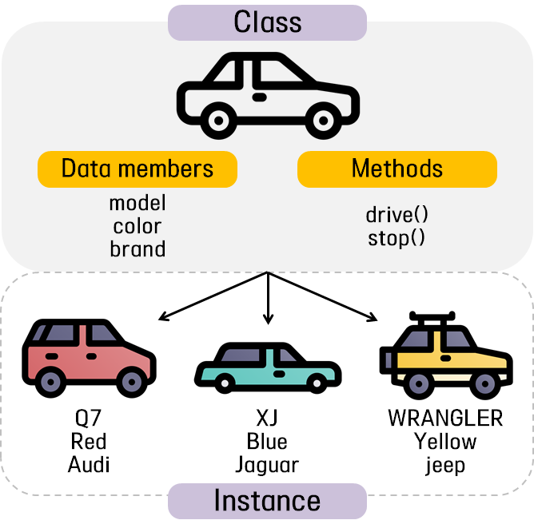
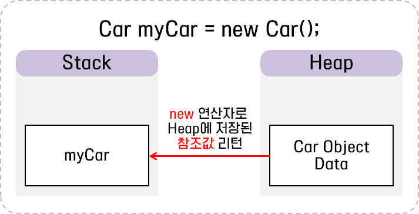
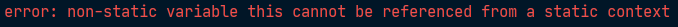

# 5주차 과제: 클래스

### 목표

자바의 Class에 대해 학습하세요.

### 학습할 것 (필수)

- 클래스 정의하는 방법
- 객체 만드는 방법 (new 키워드 이해하기)
- 메소드 정의하는 방법
- 생성자 정의하는 방법
- this 키워드 이해하기

### 마감일시

2020년 12월 19일 토요일 오후 1시까지.

### 과제 (Optional)

- int 값을 가지고 있는 이진 트리를 나타내는 Node 라는 클래스를 정의하세요.
- int value, Node left, right를 가지고 있어야 합니다.
- BinrayTree라는 클래스를 정의하고 주어진 노드를 기준으로 출력하는 bfs(Node node)와 dfs(Node node) 메소드를 구현하세요.
- DFS는 왼쪽, 루트, 오른쪽 순으로 순회하세요.


## Class

#### 클래스(Class)

객체(object)를 정의하는 틀 또는 설계도와 같은 것

클래스는 객체의 상태를 나타내는 필드(field)와, 객체의 행동을 나타내는 메소드(method)로 구성된다.

#### 인스턴스(Instance)

클래스로부터 선언된 객체를 인스턴스라고 함, 즉 메모리에 할당된 객체를 의미한다.

자바에서는 하나의 클래스로부터 여러 개의 인스턴스를 생성할 수 있다. 

많이들 언급하는 예시로 붕어빵 틀을 클래스, 만들어진 붕어빵을 인스턴스라고들 한다.



위의 이미지에서와 같이 차는 설계도 역할을 하는 클래스라고 할 수 있으며, 설계도에 의해 생산되는 여러가지 차를 인스턴스라고 일컬을 수 있다. 

차 인스턴스들은 같은 필드와 메소드를 공유하지만 그 값은 각각 다른 것을 확인할 수 있다.


## 클래스의 구성요소

#### 필드(field)

클래스의 필드란 클래스에 포함된 변수(variable)를 의미한다. 이렇게 클래스에 선언된 변수를 객체 변수, 인스턴스 변수, 멤버 변수, 속성이라고도 말한다고 한다.

클래스 내에서 필드는 선언된 위치에 따라 **클래스 변수(static variable), 인스턴스 변수(instance variable), 지역 변수(local variable)**로 구분된다. 

#### 메소드(method)

클래스에서 메소드란 클래스 내에 구현된 함수를 의미하며, 어떤 작업을 수행하기 위한 명령문의 집합이라고 할 수 있다.

#### 생성자(constructor)

생성된 객체의 필드를 초기화해주는 메소드. 생성자를 정의하는 방법은 뒤에서 자세히 다룬다.

클래스를 구성한 예시 코드는 다음과 같다.

```java
class Car(){	// 클래스 이름
    private static String modelName;	// 필드(클래스 변수)
    private String color;		// 필드(인스턴스 변수)
    private String brandName;	// 필드(인스턴스 변수)
    
    Car(String modelName, String color, String brandName){	// 생성자
        this.modelName = modelName;
        this.color = color;
        this.brandName = brandName;
    }
    
    public void drive(){	// 메소드 
    	int speed = 80;		// 필드(지역 변수)
    }
}
```


## 클래스의 정의

클래스 정의 방법은 다음과 같다.


​										*<이미지 출처: http://www.tcpschool.com/java/java_class_declaration>*

클래스를 선언하기 위해서는 접근 제어자와 함께 ``class`` 키워드를 사용하여 정의할 수 있다. 접근 제어자는 필요에 따라 생략이 가능하다. 

클래스 이름을 지을 때는 대문자로 시작하며, 이름에 2가지 단어가 혼합되어 있다면 두 번째 단어 역시 대문자로 시작하는 것이 좋다. 이는 자바 네이밍 컨벤션(Java Naming Conventions) 중 **카멜 케이스(CamelCase) 규칙**이라고 한다. (마치 낙타의 등과 같아서..!)

이와 같은 자바 네이밍 규약은 필수는 아니고 권장사항 이지만 클래스 이름을 지을 때 뿐만 아니라, 변수, 메소드명 등을 지을 때 많은 개발자들이 따르는 사항이니까 여기서 참고하고 넘어가면 좋을 것 같다.

>✅ **Java Naming conventions**
>
>https://www.oracle.com/java/technologies/javase/codeconventions-namingconventions.html
>
>https://tworab.tistory.com/59


#### 인스턴스 생성

위의 이미지와 같이 정의된 클래스를 객체로 생성하는 방법은 다음과 같다.

```java
// 클래스이름 객체참조변수이름 = new 클래스이름();
Car myCar = new Car();
```

클래스 이름과 객체를 참조할 변수명을 선언한 뒤, ``new`` 키워드를 사용하여 인스턴스를 생성할 수 있다.

해 해당 인스턴스의 주소를 참조 변수에 대입하여 사용한다.

``new`` 키워드는 클래스 타입의 인스턴스를 생성해주는 역할을 담당하며, 정확하게는 메모리(Heap 영역)에 데이터를 저장할 공간을 할당받고 그 공간의 참조값(reference value/해시코드)을 인스턴스에 리턴하여 주고 이어서 생성자를 호출하게 된다.




## 메소드(Method)

#### 메소드 정의

메소드를 정의하는 방법은 일반 함수를 정의하는 방법과 크게 다르지 않다.

```
접근제어자 반환타입 메소드이름(매개변수목록){	// 선언부
	// 구현부
}
```

1. **접근 제어자**: 해당 메소드에 접근할 수 있는 범위를 명시한다.( ``private`` / ``public`` / ``protected``)
2. **반환 타입(return type)**: 메소드가 모든 작업을 마치고 **반환하는 데이터의 타입**을 명시한다.
3. **메소드 이름**: 메소드를 호출하기 위한 이름을 명시한다. 
4. **매개변수 목록(parameters)**: 메소드 호출 시에 전달되는 **인수의 값을 저장할 변수**들을 명시한다.
5. **구현부**: 메소드의 고유 기능을 수행하는 명령문의 집합


#### 메소드 호출

메소드는 멤버 참조 연산자``.``를 사용하여 호출할 수 있다. 메소드를 호출하는 방법은 다음과 같다.

```
객체참조변수이름.메소드이름();			// 매개변수가 없는 메소드의 호출
객체참조변수이름.메소드이름(인수1, 인수2); // 매개변수가 있는 메소드의 호출
```


메소드는 입출력 유무에 따라 4가지로 분류할 수 있다. 

- 입력과 출력(리턴값)이 모두 있는 메소드
- 입력과 출력(리턴값)이 모두 없는 메소드
- 입력은 없고 출력(리턴값)은 있는 메소드
- 입력은 있고 출력(리턴값)은 없는 메소드


4가지 분류에 따라 메소드를 정의하고 호출하는 예제를 확인해보자.

```java
// [평범한 메소드 / 입력값이 없는 메소드 / 리턴값이 없는 메소드 / 입력값도 리턴값도 없는 메소드]
class Car {
    private String modelName;    

    // 입력은 있고 리턴값은 없는 메소드
    public void drive(int speed){
        System.out.println("시속 " + speed + "km로 주행합니다.");
    }
    
    // 입력과 리턴값 모두 있는 메소드
    public int returnGasPrice(int distance, int fuelEconomy){
        return (distance / fuelEconomy ) * 1500;
    }
    
    // 입력은 없고 리턴값은 있는 메소드
    public int wheelCount(){
        return 4;
    }
    
    // 입력과 리턴값이 모두 없는 메소드
    public void hello() {		
        System.out.println("안녕하세요. 만나서 반갑습니다.");
    }
}

public class Week05{
    public static void main(String[] args){
        Car myCar2 = new Car();

        myCar2.drive(80);	// 시속 80km로 주행합니다.

        int gasPrice = myCar2.returnGasPrice(100, 4);
        System.out.println("주유비 = " + gasPrice);	// 주유비 = 37500

        int wheelCount = myCar2.wheelCount();
        System.out.println("바퀴갯수 = " + wheelCount);  // 바퀴갯수 = 4

        myCar2.hello();	// 안녕하세요. 만나서 반갑습니다.
    }
}
```

위의 예제에서 첫번째로 **``drive()`` 메소드**를 정의하였다. 이 메소드는 ``public`` 접근 제어자를 사용해 선언되어 해당 객체를 사용하는 곳 어디에서나 직접 접근할 수 있다. 

반환 타입에는 어떠한 값도 반환하지 않는다는 의미를 가진 ``void``를 명시하여, ``return``값이 없음을 확인할 수 있다. 그 다음으로 메소드의 이름을 명시하고 매개변수로 ``int``형 변수인 ``speed``를 전달받는다. 이렇게 전달받은 매개변수를 가지고 메소드 구현부에서 출력 작업을 수행하고 있다.

두 번째로는 입력값과 리턴값이 있는 메소드로 주유비를 계산해주는 **``returnGasPrice()`` 메소드**를 정의하였다. ``int`` 형 타입의 ``distance``(주행거리), 와 ``fuelEconomy``(연비) 두 매개변수를 받아 주유비를 계산한 후 그 결과를 ``int``형으로 리턴해주고 있다. 

세 번째로는 입력은 없고 리턴값만 있는 메소드로 **``wheelCount()`` 메소드**를 정의하였다. 매개변수가 없지만 자동차 바퀴 개수인 4를 ``int``형 타입으로 리턴하고 있는 것을 확인할 수 있다.

마지막으로, 입력과 리턴값 모두 없는 메소드로 **``hello()``**를 정의하였다. 매개변수 없이 인삿말을 출력할 수 있도록 구현하였다.  

이렇게 선언한 ``Car`` 클래스를 사용해 ``main``메소드에서 인스턴스를 생성하고 있다. 그 후에 ``.``연산자를 이용해 각 메소드를 호출하는 것을 확인할 수 있다. 


## 생성자(Constructor)

생성자는 객체의 생성과 동시에 인스턴스 변수를 원하는 값으로 초기화할 수 있는 메소드다. 

생성자의 이름은 해당 클래스의 이름과 같아야 하며 다음과 같은 특징이 있다.

1. 생성자는 반환값이 없지만, 반환 타입을 ``void``형으로 선언하지 않는다.
2. 생성자는 초기화를 위한 데이터를 인수로 전달받을 수 있다.
3. 객체를 초기화하는 방법이 여러개 존재할 경우에는 하나의 클래스가 여러 개의 생성자를 가질 수 있다. 
   즉, 생성자도 하나의 메소드이므로, 메소드 오버로딩이 가능하다. 

(메소드 오버로딩에 대한 것은 뒤에서 알아보도록 한다)


#### 생성자의 선언

클래스 생성자를 선언하는 문법은 다음과 같다.

```
클래스이름(){ }					// 매개변수가 없는 생성자 선언
클래스이름(인수1, 인수2, ...){ }	 // 매개변수가 있는 생성자 선언
```


#### 기본 생성자(default constructor)

자바의 모든 클래스에는 하나 이상의 생성자가 정의되어야 하지만, 생성자를 정의하지 않고도 인스턴스를 생성할 수 있다. 이는 자바 컴파일러가 기본 생성자를 기본적으로 제공해주기 때문이다.

기본 생성자는 매개변수를 하나도 가지지 않으며, 어떠한 명령어도 포함하고 있지 않다.

```java
class Car(){	
    private static String modelName = "G클래스";
    private String color;		
    private String brandName;    
    
    public void printModelName(){
        System.out.println("이 차의 모델명은 " + this.modelName + " 입니다");
    }
}
public class Week05{
    public static void main(String[] args){
        Car myCar = new Car();	// 기본 생성자 호출, 인스턴스 생성
        myCar.printModelName();		// "이 차의 모델명은 G클래스 입니다"
    }
}
```

위의 에제에서 ``Car`` 클래스에는 어떠한 생성자도 정의되어 있지 않다. 하지만 ``Car myCar = new Car();`` 코드로 인스턴스 생성을 하고 있다. 그리고 ``myCar.printModelName();`` 을 통해 클래스에 정의된 메소드도 잘 동작하는 것을 확인할 수 있다.

자바 컴파일러가 컴파일 할 때 클래스에 생성자가 하나도 정의되어 있지 않으면 ``Car() {}`` 형태의 기본 생성자를 추가해준다. 그래서 기본 생성자가 호출되어 인스턴스가 생성 되는 것이다. 

하지만 매개변수를 가지는 생성자를 하나라도 정의했다면, 기본 생성자는 자동으로 추가되지 않는다.
따라서, 매개변수를 가지는 생성자를 하나 이상 정의한 후 기본 생성자를 호출하면 오류가 발생한다.

```java
class Car(){	
    private String modelName;
    private String color;
    private String brandName;

	Car(String modelName, String color, String brandName){
        this.modelName = modelName;
        this.color = color;
        this.brandName = brandName;
    }
    
    public void printModelName(){
        System.out.println("이 차의 모델명은 " + this.modelName + " 입니다");
    }
}
public class Week05{
    public static void main(String[] args){
        Car myCar = new Car();		// 컴파일에러 발생
        Car myCar = new Car("G클래스", "Black", "Benz");	// 정의된 생성자 호출
        myCar.printModelName();		// "이 차의 모델명은 G클래스 입니다"
    }
}
```

매개변수 3개를 가지는 생성자를 정의하였다. 해서 자바 컴파일러는 기본 생성자를 추가하지 않았기 때문에 기본 생성자를 호출하여 인스턴스를 생성하려는 ``new Car();`` 코드에서 오류가 발생한다.

그렇기 때문에 정의한 생성자가 갖는 매개변수의 개수에 맞추어 ``new Car("G클래스", "Black", "Benz");``와 같이 생성자를 호출해야 인스턴스가 생기는 것을 확인할 수 있다.


## this

``this``는 객체가 **자기 자신을 참조**하는 데 쓰이는 키워드다.

```java
class Car {
    private String modelName ;
    private String color;
    private String brandName;

    Car(String modelName, String color, String brandName){
        modelName = modelName;
        color = color;
        brandName = brandName;
    }

    public void printModelName(){
        System.out.println("이 차의 모델명은 " + this.modelName + " 입니다");
    }
}

public class Week05{
    public static void main(String[] args){
        Car myCar = new Car("G클래스", "Black", "Benz");
        myCar.printModelName();		// 이 차의 모델명은 null 입니다
    }
}
```

일반적으로 생성자의 매개변수 이름은 클래스의 속성 이름과 동일하게 정의되어 사용된다. 

위의 코드에서 생성자의 매개변수와 클래스의 필드가 동일한 이름으로 정의되어 있다. 하지만, main 메소드에서 ``Car`` 객체를 생성하여 아래 ``printModelName()`` 메소드를 실행했더니 ``null``값을 출력되었다.

생성자의 구현부에서 ``modelName = modelName;``과 같이 사용하면 대입연산자 좌,우에 있는 변수를 모두 생성자에 전달한 매개변수로 인지하게 된다. (``modelName(매개변수) = modelName(매개변수)``) 그래서 인스턴스 변수의 초기화가 제대로 이루어지지 않는 것이다.

```java
class Car {
    private String modelName ;
    private String color;
    private String brandName;

    Car(String modelName, String color, String brandName){
        this.modelName = modelName;
        this.color = color;
        this.brandName = brandName;
    }

    public void printModelName(){
        System.out.println("이 차의 모델명은 " + this.modelName + " 입니다");
    }
}

public class Week05{
    public static void main(String[] args){
        Car myCar = new Car("G클래스", "Black", "Benz");
        myCar.printModelName();		// 이 차의 모델명은 null 입니다
    }
}
```

이 때 ``this``키워드를 사용하여, 같은 이름을 가진 생성자의 매개변수와 인스턴스 변수를 구분해야 한다.  ``this.modelName = modelName;`` 과 같은 형태로 코드를 작성하면, ``modelName(클래스 필드) = modelName(매개변수)``와 같은 형태가 되어 인스턴스 변수에 값이 대입이 된다. 

하지만, this 참조 변수를 사용할 수 있는 영역은 인스턴스 메소드 뿐이며, 클래스 메소드에서는 사용할 수 없다.

```java
class Car {
    private String modelName ;
    private String color;
    private String brandName;

    Car(String modelName, String color, String brandName){
        modelName = modelName;
        color = color;
        brandName = brandName;
    }

    public void printModelName(){
        System.out.println("이 차의 모델명은 " + this.modelName + " 입니다");
    }

    static void setColor(String color) {	// 클래스 메소드
        this.color = color;
    }
}

public class Week05{
    public static void main(String[] args){
        Car myCar = new Car("G클래스", "Black", "Benz");
        myCar.printModelName();
    }
}
```

위에서 ``static``키워드를 사용해 ``setColor``라는 클래스 메소드를 정의하였다. 그리고 컴파일한 결과, 다음과 같은 오류가 발생하였다. 



왜냐하면, 클래스 메소드는 인스턴스 생성 없이 호출이 가능한 반면, 인스턴스 변수는 인스턴스를 생성해야만 존재하기 때문이다. 그래서 ``static`` 키워드가 붙은 클래스 메소드를 호출할 때는 인스턴스가 생성이 되어있다는 보장이 없기 때문에, 클래스 메소드에서 인스턴스 변수의 사용을 허용하지 않는다. 


​													*<이미지 출처: https://tenlie10.tistory.com/128>*


#### this() 메소드

``this()``메소드는 같은 클래스의 다른 생성자를 호출할 때 사용되며, 생성자 내부에서만 사용할 수 있다. 

생성자는 매개변수의 개수에 따라 다르게 정의를 할 수 있는데 이는 메소드 오버로딩 때문이다. (이는 뒤에서 자세히 다루겠다. ) 여러개의 생성자가 오버로딩이 되어 있을 때, 일부분을 제외하고는 서로 중복된 코드를 가지고 있는 경우가 많다. 이 때, 내부에 정의된 다른 생성자를 호출하여 코드의 중복을 피하고 깔끔한 소스를 작성할 수 있다.

예제를 확인해보자.

```java
class Car {
    private String modelName ;
    private String color;
    private String brandName;

    Car(){
        // Car(String modelName, String color, String brandName) 호출
        this("모델명 없음", "white", "브랜드 없음");
    }

    Car(String modelName, String color, String brandName){
        this.modelName = modelName;
        this.color = color;
        this.brandName = brandName;
    }

    public void printModelName(){
        System.out.println("이 차의 모델명은 " + this.modelName + " 입니다");
    }
}

public class Week05{
    public static void main(String[] args){
        Car myCar = new Car();
        myCar.printModelName();		// 이 차의 모델명은 모델명 없음 입니다

        Car myCar2 = new Car("G클래스", "Black", "Benz");
        myCar2.printModelName();	// 이 차의 모델명은 G클래스 입니다
    }
}
```

클래스에 매개변수를 가지지 않는 생성자 ``Car()``를 확인해보자.  내부에서 ``this()`` 메소드를 이용하여 매개변수를 3개 가지는 그 다음 생성자를 호출하고 있다. 그래서 main 메소드에서 ``new Car();``로 기본생성자를 호출하였더니 모델명이 없다는 결과값이 출력되었다. 

이렇게 생성자를 호출할 때에 원하는 생성자의 매개변수를 확인하여 일반 메소드를 호출하듯이 ``this()`` 메소드를 사용해 내부적으로 다른 생성자를 호출하면서 인스턴스 변수를 초기화할 수 있다.

단, 한 생성자에서 다른 생성자를 호출할 때에는 반드시 첫 줄에서만 호출할 수 있다.


## 메소드 오버로딩(method overloading)

메소드 오버로딩이란 같은 이름의 메소드를 중복하여 정의하는 것을 의미한다. 

자바에서는 한 클래스 내에 같은 이름의 메소드를 둘 이상 가질 수 없지만, 매개변수의 개수나 타입을 다르게 하면 하나의 이름으로 여러 개의 메소드를 작성할 수 있다.

메소드의 선언부에 명시되는 매개변수의 리스트를 가리켜 메소드 시그니처(method signature)라고 하는데, 
이 메소드 시그니처를 서로 다르게 갖지만 같은 이름으로 여러 개의 메소드를 정의하는 것을 메소드 오버로딩이라고 할 수 있겠다.

앞서, ``this()`` 연산자 예제를 통해 보았듯이 메소드 오버로딩을 사용하면 메소드에 사용되는 이름과 코드를 절약할 수 있다.

메소드 오버로딩은 객체 지향 프로그래밍의 특징 중 하나인 **다형성(polymorphism)**을 구현하는 방법 중의 하나이다. 여기서 다형성이란 '여러 가지 형태를 가질 수 있는 능력'을 의미한다. 아마도 이후에 다루게 될 인터페이스나 상속도 다형성을 구현하는 방법 들이다.


#### 메소드 오버로딩의 조건

자바에서 메소드 오버로딩이 성립하기 위해서는 다음과 같은 조건을 만족해야 한다.

1. 메소드 이름이 같아야 한다.
2. 메소드의 매개변수 개수 또는 타입이 달라야 한다. 


그럼 메소드 오버로딩을 구현한 예제를 살펴보자.

```java
class Car {    
    public void display(String modelName){
        System.out.println("modelName = " + modelName);
    }
    public void display(int speed) {
        System.out.println("speed = " + speed);
    }
    public void displayt(String modelName, int speed) {
        System.out.println("modelName = " + modelName + ", speed = " + speed);
    }    
    public void display(String brandName) {	// 오류 발생
        System.out.println("Car.print");
    }
}

public class Week05{
    public static void main(String[] args){

        Car myCar = new Car();
        myCar.display(80);		// speed = 80
        myCar.display("G클래스"); // modelName = G클래스
        myCar.display("k9", 90); // modelName = k9, speed = 90
    }
}
```

매개변수를 그대로 출력하는 ``print()``라는 메소드를 오버로딩을 사용해 여러 개 정의하였다. 인스턴스를 생성한 뒤 같은 메소드를 여러 번 호출하고 있지만, 매개변수의 타입과 개수의 다름을 인지하여 그에 맞는 메서드가 호출이 되어 정상적으로 출력하는 것을 확인할 수 있다.

그리고 네번째로 정의한 ``print()`` 메소드는 첫번째에 정의한 메소드와 충돌이 일어나서 오류가 발생하는 것 또한 확인할 수 있다.


#### Reference URL

>http://www.tcpschool.com/java/
>
>https://wikidocs.net/225
>
>https://blog.naver.com/heartflow89/220955262405
>
>https://library1008.tistory.com/4
>
>https://vaert.tistory.com/101
>
>https://blog.naver.com/heartflow89/220954420688
