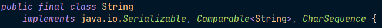

# 6주차 과제: 상속

## 목표

자바의 상속에 대해 학습하세요.

## 학습할 것 (필수)

- 자바 상속의 특징
- super 키워드
- 메소드 오버라이딩
- 다이나믹 메소드 디스패치 (Dynamic Method Dispatch)
- 추상 클래스
- final 키워드
- Object 클래스


## 상속(Inheritance)

상속이란 기존의 클래스에 기능을 추가하거나 재정의하여 새로운 클래스를 정의하는 것이다.

상속을 이용하면 기존에 정의되어 있는 클래스의 모든 필드와 메소드를 물려받아, 새로운 클래스를 생성할 수 있다. 이 때 기존에 정의되어 있던 클래스를 **부모 클래스(parent class)** 또는 **상위 클래스(super class)**라고도 한다.

그리고 상속을 통해 새롭게 작성되는 클래스를 **자식 클래스(child class)** 또는 **하위 클래스(sub class)** 라고도 한다.


#### 상속 구현 예시

```java
class Person{
    private int age = 40;
    public int year = 1980;
}

class Child extends Person{
    public int height = 140;
    void display(){
        System.out.println(age);        
        System.out.println(year);
        System.out.println(height);
    }
}

public class Week06{
    public static void main(String[] args){
        Child ch = new Child();
        ch.display();
    }
}
```


#### 상속의 장점

1. 기존에 작성된 클래스를 재활용할 수 있어 클래스가 간결해진다.
2. 자식 클래스 설계 시 중복되는 멤버를 미리 부모 클래스에 작성해 놓으면, 자식 클래스에서는 해당 멤버를 작성하지 않아도 된다. 즉, 멤버 중복 선언이 필요없다.
3. 클래스 간의 계층적 관계를 구성함으로써 다형성의 문법적 토대를 마련한다.


#### 상속의 특징

1. 다중 상속을 지원하지 않는다. 즉, **단일 상속(Single Inheritance)**만 가능하다.
   - 다중 상속의 단점
     - 메소드 출처의 모호성: 여러 부모 클래스들 중에서 이름이 같은 메소드가 있을 경우 어떤 메소드를 상속받아야 하는지 모호하여 문제(충돌)가 생김
     - 필요 없는 부분까지 상속을 받아야 하기 때문에 매우 무거워진다.
   - 대신 자바는 **Interface 다중 구현**을 제공한다.
2. 선택적 상속이 불가능 하다. All or Not 만 가능
   - 상속되는 클래스의 속성이나 기능을 선택적으로 상속받을 수 없다. 전부 다 받거나, 아예 받지 않거나 둘 중 하나만 가능하다.
   - 상속을 받게 되면 부모 클래스의 모든 속성과 기능을 상속받아 사용할 수 있다.
     - 하지만, 생성자와 초기화 블록은 상속되지 않는다.
     - 부모 클래스에서 ``private``으로 정의된 멤버 변수는 상속은 가능하지만, **접근은 불가능**하다. 그래서 ``public``으로 선언한 ``setter``또는 ``getter``를 이용해 접근한다.
   - 상속 받은 기능 중 수정을 원하는 기능은 다시 재정의 할 수 있고**(Overriding)**, 필요한 속성이나 기능은 추가하여 작성할 수 있다. ~~객체 생성의 경우에는 재사용만 가능하고 변경,추가는 불가능 하다.~~
3. 생성자는 상속되지 않는다.
   - 생성자는 반드시 클래스 이름과 동일하게 써야 하는데, 상속하면 클래스 이름이 달라지기 때문
   - 그러나 재사용을 위해 하위 클래스에서 상위 클래스의 생성자를 호출할 수 있는데, 이는 ``super`` 키워드를 사용하면 가능하다. 단, 반드시 첫 줄에서만 가능하다.
4. 상속의 횟수에 제한을 두지 않는다.
5. 계층 구조의 최상위에 있는 클래스는 Object 클래스이다.


자손은 조상의 모든 멤버를 상속받는다(생성자, 초기화블럭 제외)

자손의 멤버 개수는 조상보다 적을 수 없다.(같거나 많다.)

자손의 변경은 조상에 영향을 미치지 않는다.


## Super

``super`` 키워드는 부모 클래스로부터 상속받은 필드나 메소드를 자식 클래스에서 참조할 때 사용하는 키워드다.

부모 클래스의 멤버와 자식 클래스의 멤버 이름이 같을 경우 ``super`` 키워드를 사용하여 접근할 수 있으며, ``this`` 키워드와 사용방법이 비슷하다.

또한, ``super`` 참조 변수를 사용할 수 있는 대상도 인스턴스 메소드뿐이며, 클래스 메소드에서는 사용할 수 없다.

```java
class Person{
    public int a = 4;
    public int b = 10;
}

class Child extends Person{
    public int b = 100;
    void display(){
        System.out.println(a);
        System.out.println(this.a);
        System.out.println(super.a);
        
        System.out.println(b);
        System.out.println(this.b);
        System.out.println(super.b);
    }    
}

public class Week06{
    public static void main(String[] args){
        Child ch = new Child();
        ch.display();
    }
}
```


#### super() 메소드

``this()`` 메소드가 같은 클래스의 다른 생성자를 호출할 때 사용된다면, ``super()`` 메소드는 부모 클래스의 생성자를 호출할 때 사용된다.

자식 클래스의 인스턴스를 생성하면, 해당 인스턴스에는 자식 클래스의 고유 멤버뿐만 아니라 부모 클래스의 모든 멤버까지도 포함되어 있다. 따라서, 부모 클래스의 멤버를 초기화하기 위해서는 자식 클래스의 생성자에서 부모 클래스의 생성자까지 호출해야 한다. 


## Object

모든 클래스의 최고 조상 클래스로, 부모가 없는 클래스는 자동적으로 Object 클래스를 상속받게 된다.

모든 클래스는 Object 클래스에 정의된 11개의 메서드를 상속받는다. 11개의 메서드 중 대표적인 것으로 ``toString()``, ``equals(Object obj)``, ``hashCode()`` 등이 있다.

다음과 같이 클래스가 정의되어 있다고 가정하면, 

```java
class Point { ... }
class Circle extends Point{ ... }
```

컴파일러가 다음과 같이 Circle 클래스에 ``extends Object`` 코드를 추가해준다.

```Java
class Point extends Object { ... }
class Circle extends Point{ ... }
```


## 메서드 오버라이딩(Overriding)

상속 관계에 있는 부모 클래스에서 이미 정의된 메서드를 자식 클래스에서 재정의하는 것을 의미한다.

```java
class Point {
    int x;
    int y;
    
    String getLocation(){
        return "x: " + x + ", y: " + y;
    }
}
class Point3D extends Point {
    int z;
    
    String getLocation(){	// 메서드 오버라이딩
        return "x: " + x + ", y: " + y + ", z: " + z;
    }
}
```

메서드 오버라이딩에서 주의할 점은 선언부는 바꿀 수 없고 구현부(내용)만 변경이 가능하다는 것이다.


### 오버라이딩의 조건

1. 선언부가 조상 클래스의 메서드와 일치해야 한다. 

   선언부가 일치한다는 것은 메서드의 반환 타입, 메서드 이름, 매개변수 목록이 모두 일치해야 한다는 것이다.

2. 접근 제어자를 조상 클래스의 메서드보다 좁은 범위로 변경할 수 없다.

3. 예외는 조상 클래스의 메서드보다 많이 선언할 수 없다.

   ```java
   class Parent {
       void parentMethod() throws IOException, SQLException { ... }
   }
   class Child extends Parent {
       void parentMethod() throws IOException { ... }
   }
   ```

   자식 클래스에서 오버라이딩한 메서드에 선언된 예외는 부모클래스의 메서드에 선언된 예외보다 적거나 같아야 한다.


## 제어자(modifier)

클래스와 클래스의 멤버(멤버 변수, 메서드)에 부가적인 의미를 부여한다.

- 접근 제어자: public, protected, (default), private
- 그 외: static, final, abstract, synchronized, native, transient, volatile 등

하나의 대상에 여러 제어자를 같이 사용할 수 있지만, 접근 제어자는 하나만 사용한다. 

```java
public class Modifier{
    public static final int WIDTH = 200;
    public static void main(String[] args) { ... }
}
```

접근제어자를 제일 왼쪽에 쓰는 것이 관례다.


### static

| 사용 가능 대상 | 의미                                                         |
| -------------- | ------------------------------------------------------------ |
| 멤버변수       | - 모든 인스턴스에 공통적으로 사용되는 클래스 변수가 된다.<br />- 클래스 변수는 인스턴스를 생성하지 않고도 사용 가능하다.<br />- 클래스가 메모리에 로드될 때 생성된다. |
| 메서드         | - 인스턴스를 생성하지 않고도 호출이 가능한 static 메서드가 된다.<br />- static 메서드 내에서는 인스턴스 멤버(변수, 메서드)들을 직접 사용할 수 없다. |

### final

변경될 수 없음

| 대상                   | 의미                                                         |
| ---------------------- | ------------------------------------------------------------ |
| 클래스                 | 변경될 수 없는 클래스, 확장될 수 없는 클래스가 된다.<br />그래서 final로 지정된 클래스는 다른 클래스의 **조상이 될 수 없다**. |
| 메서드                 | 변경될 수 없는 메서드, <br />final로 지정된 메서드는 오버라이딩을 통해 **재정의 될 수 없다**. |
| 멤버변수<br />지역변수 | 변수 앞에 final이 붙으면, 값을 변경할 수 없는 **상수**가 된다. |


​												*< 이미지 출처: https://www.scientecheasy.com/ >*



> final class의 사용 예시: ``String``

### abstract

| 대상   | 의미                                                         |
| ------ | ------------------------------------------------------------ |
| 클래스 | 클래스 내에 추상 메서드가 선언되어 있음을 의미한다.          |
| 메서드 | 선언부만 작성하고 구현부는 작성하지 않은 추상 메서드임을 알린다. |

```java
abstract class AbstractTest{	// 추상 클래스(추상 메서드를 포함한 클래스)
    abstract void move();		// 추상 메서드(구현부가 없는 메서드)
}
AbstractTest a = new AbstractTest(); 	// 에러 발생(추상 클래스의 인스턴스 생성 불가)
```


#### Reference URL

> https://buddev.tistory.com/59
>
> http://www.tcpschool.com/java/intro
>
> https://www.youtube.com/channel/UC1IsspG2U_SYK8tZoRsyvfg