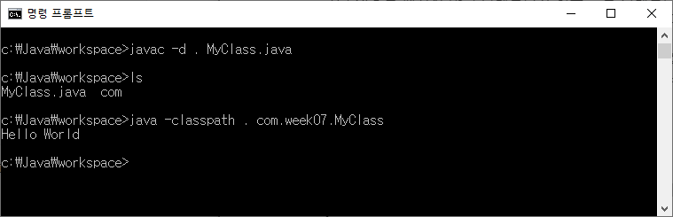

# 7주차 과제: 패키지

## 목표

자바의 패키지에 대해 학습하세요.

## 학습할 것 (필수)

- package 키워드
- import 키워드
- 클래스패스
- CLASSPATH 환경변수
- -classpath 옵션
- 접근지시자


## 패키지(package)

자바에서 패키지(package)란 서로 관련 있는 클래스와 인터페이스의 집합을 의미한다.

자바에서 패키지는 물리적으로 하나의 **디렉터리**를 의미한다. 즉, 클래스 파일(``.class``)을 포함하는 폴더를 말한다.따라서 하나의 패키지에 속한 클래스나 인터페이스 파일은 모두 해당 패키지 이름의 디렉터리에 포함되어 있다.

#### 패키지의 특징

- 서로 관련이 있는 클래스나 인터페이스를 함께 묶음으로써 파일을 효율적으로 관리할 수 있다.

- 클래스들이 필요할 때만 사용될 수 있도록 해준다.

- 클래스를 패키지 이름과 함께 계층적인 형태로 사용함으로써 다른 그룹에 속한 클래스와 발생할 수 있는 클래스 이름간의 충돌을 막아준다.

#### 패키지 선언

클래스나 클래스가 속하는 패키지는 ``package``라는 키워드와 함께 지정된다. 패키지 선언은 다음과 같이 할 수 있다.

```java
package study.week07;
```

패키지의 선언은 클래스나 인터페이스의 소스파일``(.java)``의 맨 첫 줄에 위와 같은 명령문을 적어주면 된다. 디렉토리의 계층 구조는 점(.)으로 구분 된다.

원칙적으로 모든 클래스는 반드시 하나의 패키지에 속해있어야 하지만, 패키지를 선언하지 않는다고 해서 컴파일 단계에서 에러가 발생하지는 않는다. 왜냐하면 클래스에서 따로 패키지를 선언해주지 않으면, 그 클래스는 기본적으로 **default package**에 속하게 되기 때문이다. 

#### 패키지 제약사항

1. 소스의 **가장 첫 줄**에 위치해야 한다. 
2. 하나의 소스파일에는 단 한 번의 패키지 선언만을 허용한다.
3. 패키지 이름과 클래스가 위치한 폴더 이름은 같아야 한다.
4. 패키지 이름은 java로 시작해서는 안된다. java 패키지는 자바의 기본 패키지로 JVM 개발자들만이 생성할 수 있는 패키지이기 때문.
   - **패키지 이름 작성시 유의사항**
     - 패키지 이름은 모두 소문자로 지정해야한다.(권장사항)
     - 자바의 에약어를 사용해서는 안된다. 패키지 이름에 중간에라도 ``int``와 같은 예약어가 위치하면 컴파일 시 에러가 발생한다.
     - 패키지 이름은 숫자로 시작할 수 없다.


## import

위와 같이 선언한 패키지에 속한 클래스를 다른 파일에서 사용하기 위해서 사용되는 것이 ``import`` 키워드다.

패키지에 속한 클래스를 사용하기 위해서는 클래스의 패키지명을 모두 적어줘야 하는데, ``import``문은 이를 쓰지 않고도 이용할 수 있도록 만들어 준다. 

``import`` 문은 자바 컴파일러와 JVM에게 코드에서 사용할 클래스의 패키지에 대한 정보를 미리 제공하는 역할을 한다.

#### import 문 선언

import 문은 다음과 같이 선언할 수 있으며, ``package``와 ``Class`` 선언 사이에 위치해야 한다.

```java
import java.awt.event.*;			// import 패키지명.*; 패키지 내 모든 클래스
```

위와 같이 선언하면 ``java.awt.event`` 패키지 내에 있는 모든 클래스들을 가져오는 것이며,

```java
import java.awt.event.ActionEvent;	// import 패키지명.클래스명; 패키지 내 특정 클래스
```

이렇게 선언하면 ``java.awt.event`` 패키지 내에 있는 ``ActionEvent`` 클래스만 가져온다.

만약에 ``import`` 선언 없이 클래스를 직접 사용하려면, 패키지 전체 주소를 가져와 다음과 같이 사용할 수 있다.

```java
java.awt.event.ActionEvent myEvent = new java.awt.event.ActionEvent(); 
```

#### static import

``import`` 문은 ``static`` 클래스, 메소드, 데이터 필드들에도 적용이 가능하다.

자주 사용하는 클래스나 메소드를 ``static``으로  ``import``하면 코드를 간소화하여 작성할 수 있다.

```java
package example.week07;

import static java.lang.System.out;

public class statictest {
    public static void main(String[] args){
//        System.out.println("Hello");        
        out.println("Hello");
    }
}
```


## 클래스패스(Classpath)

클래스패스란 확장자가 ``.class``인 클래스 파일을 찾는 경로를 의미한다. 즉, JVM이 프로그램을 실행할 때, 클래스파일을 찾는 데 기준이 되는 파일 경로를 말하는 것이다.

클래스 패스를 지정하는 방법에는 환경변수 ``CLASSPATH``를 사용하는 법과, java runtim(java 또는 jre)에서 
``-classpath`` 옵션을 사용하는 것 두 가지가 있다.


#### 환경변수 CLASSPATH 등록(Windows)

- 제어판 > 시스템 및 보안 > 시스템 > 고급 시스템 설정에 들어가서 환경 변수를 클릭한다.

  

- 시스템 변수에 새로만들기를 클릭한다.


- 변수 이름과 값에 다음과 같이 입력을 한다. 변수 값을 아래 그림과 같이 입력하려면 시스템 변수에 ``JAVA_HOME``이 등록되어 있어야 한다. 그 외에 변수 값에는 **폴더 경로(디렉토리)**와 **``zip`` 파일**, **``jar``(자바 아카이브)파일**을 등록할 수 있다.

  

- cmd 창을 열어 ``echo %classpath%``를 입력하면 CLASSPATH가 제대로 등록되었는지 확인할 수 있다.


#### java runtime에서 ``-classpath`` 옵션 사용

다음과 같은 자바 파일을 하나 만들었다.

```java
package com.week07;

public class MyClass {
  public static void main(String[] args) {
    System.out.println("Hello World");
  }
}
```

자바 파일이 있는 디렉토리로 이동하여 cmd 에 ``javac -d . MyClass.java`` 를 입력해 컴파일한다. 그러면 현재 작업 디렉토리 내 ``/com/week07``에 ``MyClass.class``파일이 생성된 것을 확인할 수 있다.

그리고 java 실행 시 ``-classpath``로 현재 디렉토리 경로를 설정하고 패키지 경로를 입력해 실행하면 다음과 같이 Hello World가 출력되는 것을 확인할 수 있다.



클래스패스는 ``;``를 구분자로 여러 개의 경로를 설정할 수 있다. ``.`` 은 현재 디렉토리를 의미한다. 

또한 ``-classpath`` 대신 ``-cp``를 사용해도 된다.


## 접근 지시자

접근 제어자(access modifier)라고도 하며, 정보 은닉을 위해 사용된다. 

자바에서는 네 가지 접근 제어자( ``private``, ``public``, ``default``, ``protected`` )를 제공한다.


#### 접근 제어자의 접근 범위

1. ``public`` : 해당 객체를 사용하는 프로그램 어디에서나 접근 가능함

2. ``protected`` :  클래스를 상속받은 자식 클래스와 같은 클래스, 같은 패키지 멤버는 접근 가능

3. ``default`` : 접근 제어자가 지정되지 않으면 자동적으로 해당 접근 제어를 가지게 되며, 같은 클래스와 같은 패키지 멤버만 접근 가능

4. ``private`` : 같은 클래스 멤버만 접근이 가능함, 외부에서 직접 접근할 수 없음


접근 범위를 많은 순으로 나열하면 다음과 같다.

``public`` > ``protected`` > ``default`` > ``private``

| 접근 제어자   | 같은 클래스의 멤버 | 같은 패키지의 멤버 | 자식 클래스의 멤버 | 그 외의 영역 |
| ------------- | :----------------: | :----------------: | :----------------: | :----------: |
| ``public``    |         O          |         O          |         O          |      O       |
| ``protected`` |         O          |         O          |         O          |      X       |
| ``default``   |         O          |         O          |         X          |      X       |
| ``private``   |         O          |         X          |         X          |      X       |


### Reference URL

> http://www.tcpschool.com/java/
>
> https://programmers.co.kr/learn/courses/5/lessons/172
>
> https://blog.naver.com/29java/70188825312
>
> https://muckycode.blogspot.com/2017/07/java-package.html
>
> https://ko.wikipedia.org/wiki/자바_패키지
>
> https://effectivesquid.tistory.com/entry/자바-클래스패스classpath란
