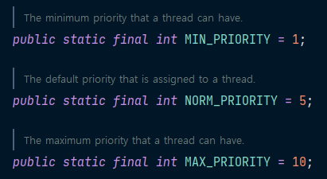
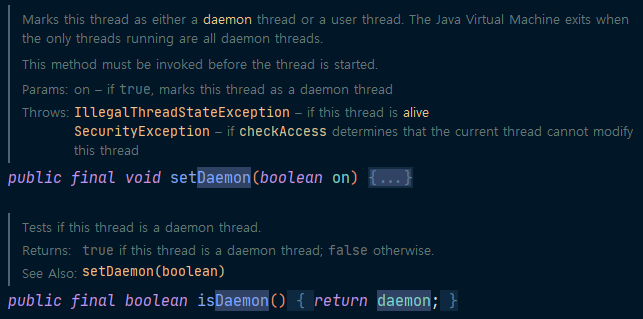

# 10주차 과제: 멀티쓰레드 프로그래밍

### 목표

자바의 멀티쓰레드 프로그래밍에 대해 학습하세요.

### 학습할 것 (필수)

- Thread 클래스와 Runnable 인터페이스
- 쓰레드의 상태
- 쓰레드의 우선순위
- Main 쓰레드
- 동기화
- 데드락


## Thread와 Process

Thread를 알기에 앞서 함께 알아야 할 것이 process다.

### Process

프로세스는 컴퓨터에서 연속적으로 실행되고 있는 컴퓨터 프로그램을 일컫는다.

프로세스는 프로그램에 사용되는 데이터와 메모리 등의 자원과 스레드(Thread)로 구성 된다.

### Thread

스레드는 프로세스(Process) 내에서 실제로 작업을 수행하는 주체를 말한다.

모든 프로세스(Process)에는 한 개 이상의 스레드가 존재하여 작업을 수행하며, 두 개 이상의 스레드를 가지는 프로세스를 멀티스레드 프로세스(Multi-threaded Process)라고 한다.


다음 그림은 프로세스와 스레드의 차이와 구조를 간단하게 도식화한 것이다.


​						< 이미지 출처: https://sites.google.com/site/sureshdevang/thread-vs-process >


같은 작업을 수행하더라도 싱글쓰레드보다 멀티 쓰레드에서 작업 소요 시간이 조금 더 걸릴 수 있는데, 이는 **context switching** 이 일어나기 때문이다. 


멀티쓰레드의 장점

자원을 효율적으로 쓸 수 있음

쓰레드의 I/O 블락킹(blocking)

입출력시 작업 중단


## Thread의 생성과 실행

자바에서 스레드를 생성하는 방법에는 

1. Runnable 인터페이스 구현
2. Thread 클래스를 상속받는 방법

두 가지가 있다. 두 방법 모두 스레드를 통해 작업하고 싶은 내용을 run() 메소드에 작성하면 된다.


**Runnable 인터페이스 구현**

```java
package example.week10;

public class RunnableTest implements Runnable{
    @Override
    public void run() {	// 쓰레드가 수행할 작업을 작성
        for (int i = 0; i < 5; i++) {
            // Thread.currentThread() : 현재 실행중인 Thread를 반환
            System.out.println(Thread.currentThread().getName());
        }
        try {
            Thread.sleep(10);
        } catch (InterruptedException e) {
            e.printStackTrace();
        }
    }
}
```

**Thread 클래스 상속**

```java
package example.week10;

public class ThreadTest extends Thread {
    public void run() {
        for (int i = 0; i < 5; i++) {
            System.out.println(getName());
            try {
                Thread.sleep(10);
            } catch (InterruptedException e) {
                e.printStackTrace();
            }
        }
    }
}
```

사용 예시

```java
package example.week10;

public class Thread01 {
    public static void main(String[] args) {
        ThreadTest thread01 = new ThreadTest();     // Thread 클래스 상속
        Thread thread02 = new Thread(new RunnableTest());   // Runnable 인터페이스 구현

        // 쓰레드의 실행
        thread01.start();
        thread02.start();
    }
}
```

실행 결과


쓰레드를 생성한 후에 ``start()``를 호출해야 쓰레드가 작업을 시작한다. 그러나 ``start()`` 메서드를 호출했다고 해서 즉시 실행되는 것은 아니며,  쓰레드의 실행 순서는 코드 작성 순서와는 무관하다. 

쓰레드의 실행 순서는 OS 스케줄러가 결정한다. 그리고 쓰레드의 실행 순서는 예측할 수 없는 불확실성을 가지고 있다.


``start()`` 메서드를 호출해야 새로운 호출 스택이 생성이 되며 ``main`` 메서드와 별개로 ``run()`` 메서드가 독립적으로 작업을 수행하게 된다.


## Main Thread

``main()`` 메서드의 코드를 수행하는 쓰레드

쓰레드에는 '사용자 쓰레드'와 '데몬 쓰레드' 두 가지 종류가 있으며, '사용자 쓰레드'는 '메인 쓰레드'라고 할 수 있다.

실행 중인 사용자 쓰레드가 하나도 없을 때 프로그램은 종료 된다.

```java
public class MainThreadTest {
    static long startTime = 0;

    public static void main(String[] args) {
        ThreadTest1 th1 = new ThreadTest1();
        ThreadTest2 th2 = new ThreadTest2();
        th1.start();
        th2.start();
        startTime = System.currentTimeMillis();

//        try {
//            th1.join();
//            th2.join();
//        } catch (InterruptedException e) { }
        System.out.println("소요시간: "+ (System.currentTimeMillis() - startTime));
    }
}

class ThreadTest1 extends Thread {
    public void run() {
        for (int i = 0; i < 300; i++) {
            System.out.println(new String("-"));
        }
    }
}

class ThreadTest2 extends Thread {
    public void run() {
        for (int i = 0; i < 300; i++) {
            System.out.println(new String("|"));
        }
    }
}
```

메인 메서드가 종료되어도 다른 쓰레드가 실행 중이면 프로그램이 종료되지 않는 것을 확인할 수 있다.


## 쓰레드의 우선순위

프로세스 내에 있는 쓰레드들 중에서 작업의 중요도에 따라 쓰레드의 우선순위를 다르게 하여 특정 쓰레드가 더 많은 작업시간을 갖게 할 수 있는 것

우선순위는 쓰레드가 시작된 이후에도 변경이 가능하다.



쓰레드의 우선순위는 최소 1부터 최대 10까지 총 10단계로 구성되어 있으며, 기본적인 우선순위 값은 5로 지정되어 있다. 쓰레드의 우선순위는 ``void setPriority(int newPriority)`` 메서드를 이용하여 변경할 수 있고, 쓰레드의 우선순위 값을 조회하는 것은 ``getPriority()`` 메서드를 이용하면 된다.


쓰레드의 우선순위는 10단계로 구성되어 있으나 이건 JVM이 정해놓은 기준이며, OS의 우선순위 단계와는 별개이다. 

그리고 지정하는 우선순위는 어디까지나 작성자의 희망사항일 뿐이며, 이 우선순위를 OS 스케줄러에게 전달하지만 지정해놓은 우선순위대로 작업이 수행된다는 보장이 없다.

```java
public class ThreadPriorityTest {
    public static void main(String[] args) {
        ThreadPriority01 th1 = new ThreadPriority01();
        ThreadPriority02 th2 = new ThreadPriority02();
        
//        th1.setPriority(5);
        th2.setPriority(9);

        System.out.println("Priority of th1(-): " + th1.getPriority());
        System.out.println("Priority of th2(|): " + th2.getPriority());
        th1.start();
        th2.start();
    }
    
}

class ThreadPriority01 extends Thread {
    public void run() {
        for (int i = 0; i < 300; i++) {
            System.out.println("-");
            for (int x = 0; x < 1000000; x++) ; // 시간 지연
        }
    }
}

class ThreadPriority02 extends Thread {
    public void run() {
        for (int i = 0; i < 300; i++) {
            System.out.println("|");
            for (int x = 0; x < 1000000; x++) ; // 시간 지연
        }
    }
}
```


## 데몬 쓰레드(Daemon thread)

일반 쓰레드의 작업을 돕는 보조적인 역할을 수행

데몬 쓰레드는 일반 쓰레드가 모두 종료되면 자동적으로 종료되며, 주로 가비지 컬렉터, 자동저장, 화면 자동갱신 등에 사용된다.

데몬 쓰레드는 무한루프와 조건문을 이용해서 실행 후 대기하다가 특정조건이 만족되면 작업을 수행하고 다시 대기하도록 작성하는 것이 일반적이다.



쓰레드를 데몬쓰레드로 설정하기 위해서는 ``setDaemon(boolean a)``를 사용하면 되고, 쓰레드가 일반 쓰레드인지 데몬 쓰레드 인지를 확인하고자 할 때는 ``isDaemon()`` 메서드를 이용하면 된다.

``setDaemon(boolean a)`` 메서드의 경우에는 반드시 ``start()``를 호출하기 전에 실행되어야 한다.

```java
public class DaemonThreadTest implements Runnable {
    static boolean autoSave = false;

    public static void main(String[] args) {
        Thread th = new Thread(new DaemonThreadTest());
        th.setDaemon(true);
        th.start();

        for (int i = 1; i <= 10; i++) {
            try {
                Thread.sleep(1000);
            } catch (InterruptedException e) {}
            System.out.println(i);

            if(i == 5) autoSave = true;
        }
        System.out.println("프로그램을 종료합니다.");
    }

    @Override
    public void run() {
        while (true) {
            try {
                Thread.sleep(30000); // 3초
            } catch (InterruptedException e) {
            }
            // autoSave의 값이 true면 autoSave()를 호출
            if(autoSave) autoSave();
        }
    }

    public void autoSave() {
        System.out.println("작업파일이 자동저장되었습니다");
    }
}
```


## 쓰레드의 상태

| 상태                        | 설명                                                         |
| --------------------------- | ------------------------------------------------------------ |
| NEW                         | 쓰레드가 생성되고 아직 ``start()``가 호출되지 않은 상태      |
| RUNNABLE                    | 실행 중 또는 실행 가능한 상태                                |
| BLOCKED                     | 동기화블럭에 의해서 일시정지된 상태(lock이 풀릴 때까지 기다리는 상태)<br />예) I/O blocking |
| WAITING,<br />TIMED_WAITING | 쓰레드의 작업이 종료되지는 않았지만 실행불가능한 일시정지 상태<br />TIMED_WAITING은 일시정지 시간이 지정된 경우를 의미 |
| TERMINATED                  | 쓰레드의 작업이 종료된 상태                                  |


### 쓰레드의 실행제어

쓰레드의 실행을 제어할 수 있는 메서드가 아래와 같이 제공되며, 이를 활용해 보다 효율적인 프로그램 작성이 가능하다.

| 메서드                             | 설명                                                         |
| ---------------------------------- | ------------------------------------------------------------ |
| ``static void sleep(long millis)`` | 지정된 시간동안 쓰레드를 일시정지 시킨다. 지정한 시간이 지나고 나면, 자동적으로 다시 실행대기상태가 된다. |
| ``void join()``                    | 해당 쓰레드가 종료될 때 까지 기다린다.                       |
| ``void interrupt()``               | ``sleep()``이나 ``join()``에 의해 일시정지 상태인 쓰레드를 깨워서 실행대기상태로 만든다. 해당 쓰레드에서는 ``interruptedException``이 발생함으로써 일시정지 상태를 벗어나게 된다. |
| ``void stop()``                    | 쓰레드를 즉시 종료시킨다.                                    |
| ``void suspend()``                 | 쓰레드를 일시정지시킨다. ``resume()``을 호출하면 다시 실행대기상태가 된다. |
| ``void resume()``                  | ``suspend()``에 의해 일시정지상태에 있는 쓰레드를 실행 대기상태로 만든다. |
| ``static void yield()``            | 실행 중에 자신에게 주어진 실행시간을 다른 쓰레드에게 양보하고 자신은 실행대기상태가 된다. |

여기서 ``sleep()``과 ``yield()`` 메서드는 쓰레드 자기 자신에게만 호출 및 적용이 가능하다.


## 쓰레드의 동기화

어떤 쓰레드가 진행중인 작업을 다른 쓰레드가 간섭하지 못하게 막는 것

멀티 쓰레드 프로세스에서는 쓰레드끼리 서로의 작업에 영향을 미칠 수 있는데, 이때 진행중인 작업이 다른 쓰레드에게 간섭받지 않도록 하기 위해서는 동기화가 필요하다.

다른 쓰레드에게 간섭받지 않고자 하는 문장들을 '임계 영역'으로 설정하면, 이 임계영역에 락을 얻은 하나의 쓰레드만 출입이 가능하다.

synchronized를 이용한 동기화 방법에는 두 가지가 있다.

1. 메서드 전체를 임계 영역으로 지정
2. 특정한 영역을 임계 영역으로 지정

