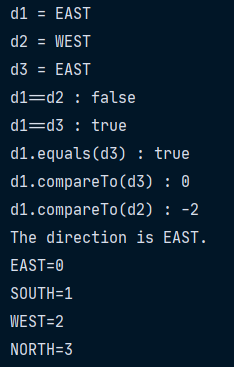
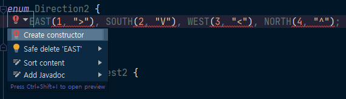
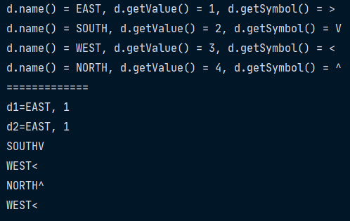

# 11주차 과제: Enum

### 목표

자바의 열거형에 대해 학습하세요.

### 학습할 것 (필수)

- enum 정의하는 방법
- enum이 제공하는 메소드 (values()와 valueOf())
- java.lang.Enum
- EnumSet


## 자바의 열거형(Enum)

관련된 상수들을 같이 묶어 놓은 것

자바에서 열거형은 값과 타입을 모두 체크하여 타입에 안전한 열거형을 제공한다.

### Enum 정의 방법

```java
enum 열거형이름 {상수명1, 상수명2, ... }
```

상수명의 이름을 나열한 순서대로 0, 1, 2, ... 값이 자동으로 부여된다.

- 사용 예시

```java
enum Direction { EAST, SOUTH, WEST, NORTH }
```

```java
class Unit
```

열거형 상수의 비교에 ``==`` 연산자와 ``compareTo()``를 사용할 수 있으며, 비교연산자는 사용할 수 없다. 


### Enum 클래스(java.lang.Enum)의 메서드

Enum 클래스는 모든 자바 열거체의 공통된 조상 클래스다. Enum 클래스에는 열거체를 조작하기 위한 다양한 메서드가 아래와 같이 포함되어 있다.

| 메서드                                        | 설명                                                 |
| --------------------------------------------- | ---------------------------------------------------- |
| ``Class<E> getDeclaringClass()``              | 열거형의 Class 객체를 반환                           |
| ``String name()``                             | 열거형 상수의 이름을 문자열로 반환                   |
| ``int ordinal()``                             | 열거형 상수가 정의된 순서를 반환(0부터 시작)         |
| ``T valueOf(Class<T> enumType, String name)`` | 지정된 열거형에서 name과 일치하는 열거형 상수를 반환 |

``values()``와 ``valueOf()`` 메서드는 컴파일러가 자동으로 추가해주는 메서드다.

- ``static E[] values()``: 열거형 상수가 가지고 있는 모든 상수를 배열로 반환
- ``static E valueOf(String name)``: 열거형 상수의 이름을 주면 해당 열거형 상수를 반환

```java
enum Direction { EAST, SOUTH, WEST, NORTH }
class EnumEx{
    public static void main(String[] args){
        Direction[] dArr = Direction.values();
        
        Direction w = Direction.valueOf("WEST"); // Direction.WEST
        
        for(Direction d : dArr){ // for(Direction d : Direction.values())
            System.out.printf("%s=%d%n", d.name(), d.ordinal());
        }
    }
}
```


```java
enum Direction{ EAST, SOUTH, WEST, NORTH }

public class EnumTest {
    public static void main(String[] args) {
        // 열거체를 사용하는 방법
        Direction d1 = Direction.EAST;
        Direction d2 = Direction.valueOf("WEST");
        Direction d3 = Enum.valueOf(Direction.class, "EAST");

        System.out.println("d1 = " + d1);
        System.out.println("d2 = " + d2);
        System.out.println("d3 = " + d3);

        System.out.println("d1==d2 : " + (d1==d2)); // false
        System.out.println("d1==d3 : " + (d1==d3)); // true
        System.out.println("d1.equals(d3) : " + d1.equals(d3));
//        System.out.println("d1 > d3 = " + (d1 > d3)); // 컴파일 에러
        System.out.println("d1.compareTo(d3) : " + d1.compareTo(d3));
        System.out.println("d1.compareTo(d2) : " + d1.compareTo(d2));

        switch (d1) {
            case EAST: // Direction.EAST 라고 쓸 수 없음
                System.out.println("The direction is EAST.");
                break;
            case SOUTH:
                System.out.println("The direction is SOUTH");
                break;
            case WEST:
                System.out.println("The direction is WEST");
                break;
            case NORTH:
                System.out.println("The direction is NORTH");
                break;
            default:
                System.out.println("Invalid direction");
                break;
        }
        Direction[] dirArr = Direction.values();
        for (Direction d : dirArr) {
            System.out.printf("%s=%d%n", d.name(), d.ordinal());
        }
    }
}
```

- 실행 결과



앞선 예제를 통해 알 수 있듯이, 열거형 상수는 상수가 아니고 객체이기 때문에 비교연산자로 비교할 수 없고 비교를 위해선 ``compareTo()`` 메서드를 사용해야 한다.

그리고 Enum 상수에 정수 값을 매칭할 때 ``ordinal()``을 사용할 수 있다. 하지만 ``ordinal()``을 사용할 경우, enum 상수 중간에 다른 값이 들어갈 경우 매칭된 값이 달라지는 매우 큰 부작용이 생긴다. 따라서. ``ordinal()`` 사용을 피해야한다.

대신 Enum 상수 값을 별도로 추가하여 사용하는 것이 낫다.

열거형 상수에 원하는 값을 넣을 때는 다음과 같이 원하는 값을 괄호``()`` 안에 적으면 된다.

```java
enum Direction { EAST(1), SOUTH(5), WEST(-1), NORTH(10) }
```

ENUM 상수에 원하는 값은 여러개도 가능하며, 괄호``()``를 사용하여 원하는 값을 넣으려먼 **인스턴스 변수**와 **생성자**를 새로 추가해줘야 한다. 

그렇다. 사실 괄호``()``를 사용하는 것은 생성자를 호출하는 것이다.



그리고 열거형의 생성자는 묵시적으로 ``private``이므로, 외부에서 호출할 수 없다.

```java
enum Direction2 {
    EAST(1, ">"), SOUTH(2, "V"), WEST(3, "<"), NORTH(4, "^");

    private static final Direction2[] DIR_ARR = Direction2.values();
    private final int value;    // 정수를 저장할 필드(인스턴스 변수)를 추가
    private final String symbol;    // 문자를 저장할 필드(인스턴스 변수)를 추가
    
    Direction2(int value, String symbol) {  // private이 생략됨
        this.value = value;
        this.symbol = symbol;
    }

    public int getValue() {
        return value;
    }

    public String getSymbol() {
        return symbol;
    }

    // 1 ~ 4 사이의 지정된 정수값을 주면 그에 해당하는 열거형 상수를 반환
    public static Direction2 of(int dir) { 
        if (dir < 1 || dir > 4)
            throw new IllegalArgumentException("invalid value: " + dir);
        return DIR_ARR[dir - 1];
    }

    public Direction2 rotate(int num) {
        num = num % 4;
        if (num < 0) {
            num += 4;
        }
        return DIR_ARR[(value-1+num) % 4];
    }

    @Override
    public String toString() {
        return name() + getSymbol();
    }
}

public class EnumTest2 {
    public static void main(String[] args) {
        for (Direction2 d : Direction2.values()) {
            System.out.println("d.name() = " + d.name() 
                               + ", d.getValue() = " + d.getValue() 
                               + ", d.getSymbol() = " + d.getSymbol());
        }
        System.out.println("=============");
        Direction2 d1 = Direction2.EAST;
        Direction2 d2 = Direction2.of(1);

        System.out.printf("d1=%s, %d%n", d1.name(), d1.getValue());
        System.out.printf("d2=%s, %d%n", d2.name(), d2.getValue());
        System.out.println(Direction2.EAST.rotate(1));
        System.out.println(Direction2.EAST.rotate(2));
        System.out.println(Direction2.EAST.rotate(-1));
        System.out.println(Direction2.EAST.rotate(-2));
    }
}
```

- 실행 결과




### Reference URL

> https://www.youtube.com/user/MasterNKS
>
> http://www.tcpschool.com/java/java_api_enum
>
> https://programmingfbf7290.tistory.com/entry/enum-자료형