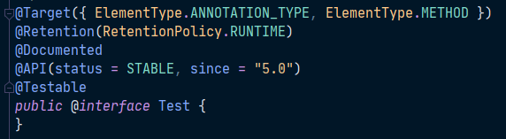

# 12주차 과제: 애노테이션

### 목표

자바의 애노테이션에 대해 학습하세요.

### 학습할 것 (필수)

- 애노테이션 정의하는 방법
- [@retention](https://github.com/retention)
- [@target](https://github.com/target)
- [@documented](https://github.com/documented)
- 애노테이션 프로세서


## 애노테이션

주석처럼 프로그래밍 언어에 영향을 미치지 않으며 유용한 정보(설정 정보)를 특정 프로그램에게 제공하는 것

예전에는 현업에서 프로그램을 작성할 경우 소스코드와 프로그램에 대한 문서를 따로 작성하였다고 한다. 그래서, 소스코드가 변경될 때마다 문서의 내용도 함께 업데이트를 해줘야 하는데 이를 번거롭게 여겨 문서와 코드의 버전이 불일치하는 경우가 많았다고 한다.

그래서 소스코드와 문서의 관리를 용이하게 하기 위해 주석``/* ... */`` 이 생겼다. 이 주석 표시를 이용하여 주석을 작성하면 javadoc 문서 생성기를 통해 HTML 형식의 API문서가 생성된다. 

설정파일도 앞선 예의 경우와 비슷하다. 예전에 소스코드와 설정파일(예: ``.xml``)을 분리하여 관리했었다고 한다. 그런데 설정파일은 여러사람이 공유해야 하는 점과 함부로 수정할 수 없는 문제점을 가지고 있었다. 이를 개선하고자 소스코드와 설정 정보를 합치기로 하면서 애노테이션이 생겼다고 한다.

애노테이션은 코드에 설정에 대한 정보를 넣기로 한 것이며, 기존 문법을 바꾸지 않아도 되는 장점이 있다. 

사용 예) ``@Test`` 라는 어노테이션의 경우 ``JUnit``이라는 특정 프로그램에서만 유효하며, 테스트 대상이 될 메소드에 이 애노테이션 하나만 추가하면 따로 테스트 될 대상을 지정해주지 않아도 된다.

또한, 예를 들어 스프링의 경우 스프링 컨테이너에게 관리할 대상인 빈에 대한 정보를 XML 파일(``application.xml``)로 작성였는데 지금은 자바코드로 설정파일을 만들어 ``@Bean``이라는 애노테이션을 사용하여 쉽게 빈을 관리할 수 있다.


### 표준 애노테이션

Java에서 제공하는 애노테이션


#### 1) @Override

오버라이딩을 올바르게 했는지 컴파일러가 체크, javac.exe가 사용하는 애노테이션

오버라이딩을 할 때 메서드 이름을 잘못 적는 실수를 하는 경우가 많음


이런 실수를 방지하고자 나온 애노테이션으로, 오버라이딩할 때는 메서드 선언부 앞에 @Override를 붙이면 된다.

이렇게 하면 컴파일 단계에서 오류가 발생하기 때문에 오타 여부를 쉽게 파악할 수 있다. 그래서 메서드 상속 시 이 애노테이션을 붙이는 습관을 들이는 것이 좋다.


#### 2) @Deprecated

앞으로 사용하지 않을 것을 권장하는 필드나 메서드를 표시하는 용도로 쓰임


자바는 하위호환성을 중요시 여겨서 구 버전의 메서드를 없애지는 않으나, 사용을 권장하지 않는다는 표시로 이 애노테이션을 사용한다.

해당 어노테이션이 붙은 메서드를 사용하여 코드를 컴파일할 경우 다음과 같은 메시지가 나타나는 것을 확인할 수 있다.


#### 3) @FunctionalInterface

함수형 인터페이스에 붙이는 애노테이션으로, 이 인터페이스가 제대로 작성(함수형 인터페이스는 하나의 추상메서드만 가져야 함)이 되었는지 컴파일러가 체크하는 용도로 사용됨


#### 4) @SuppressWarnings

컴파일러의 경고메시지가 나타나지 않게 억제하는 용도로 사용하는 애노테이션

괄호() 안에 억제하고자하는 경고의 종류를 문자열로 지정하여 사용하며, 다음과 같은 방식으로 작성하면 된다.


컴파일러가 알려주는 경고를 코드작성자가 이미 파악하여 확인했다는 표시의 의미로 사용됨

둘 이상의 경고를 동시에 억제하려면 괄호 안에 중괄호{}를 사용하여 경고의 종류를 배열 선언하는 것처럼 나열해주면 됨

그리고 `` -Xlint`` 옵션으로 컴파일하면, 경고메시지를 확인할 수 있음


대괄호 안에 있는 내용이 경고의 종류임

확인된 경고는 SuppressWarnings 애노테이션을 사용하여 경고를 억제해야, 다음에 발생할 수 있는 새로운 경고를 확인할 수 있기 때문에 이 애노테이션의 사용도 습관을 들이는 것이 좋다.


### 메타 애노테이션

애노테이션을 만들 때 사용하는 애노테이션을 위한 애노테이션이다.

메타 애노테이션은 ``java.lang.annotation`` 패키지에 포함되어 있다.

메타 애노테이션의 종류는 다음과 같으며, 아래에서 좀 더 자세히 다루도록 한다.

| 애노테이션  | 설명                                                         |
| ----------- | ------------------------------------------------------------ |
| @Target     | 애노테이션이 적용가능한 대상을 지정하는데 사용               |
| @Documented | 애노테이션 정보가 javadoc으로 작성된 문서에 포함되게 하는데 사용 |
| @Inherited  | 애노테이션이 자손 클래스에 상속되도록 할 때 사용             |
| @Retention  | 애노테이션이 유지되는 범위를 지정하는데 사용                 |
| @Repeatable | 애노테이션을 반복해서 적용할 수 있게 하는데 사용(JDK 1.8)    |


#### 1) @Target

애노테이션을 정의할 때, 애노테이션이 적용가능한 대상을 지정하는 데에 사용된다.

애노테이션이 적용가능한 대상 타입들은 다음과 같다.

| 대상 타입       | 의미                             |
| :-------------- | -------------------------------- |
| ANNOTATION_TYPE | 애노테이션                       |
| CONSTRUCTOR     | 생성자                           |
| FIELD           | 필드(멤버변수, enum 상수)        |
| LOCAL_VARIABLE  | 지역변수                         |
| METHOD          | 메서드                           |
| PACKAGE         | 패키지                           |
| PARAMETER       | 매개변수                         |
| TYPE            | 타입(클래스, 인터페이스, enum)   |
| TYPE_PARAMETER  | 타입 매개변수(JDK 1.8)           |
| TYPE_USE        | 타입이 사용되는 모든 곳(JDK 1.8) |

```java
@Target({FIELD, TYPE, TYPE_USE})	// 적용대상이 FIELD, TYPE, TYPE_USE
public @interface MyAnnotation {}	// My Annotation 정의

@MyAnnotation	// 적용대상이 TYPE인 경우
class MyClass{
    
    @MyAnnotation	// 적용대상이 FIELD인 경우
    int i;
    
    @MyAnnotation	// 적용대상이 TYPE_USE인 경우
    MyClass mc;
}
```


#### 2) @Retention

애노테이션이 유지되는 기간을 지정하는 데 사용되며, 지정할 수 있는 유지 정책들은 다음과 같다.

| 유지 정책 | 의미                                                         |
| --------- | ------------------------------------------------------------ |
| SOURCE    | **소스 파일**에만 존재, 클래스파일에는 존재하지 않음(컴파일러만 사용) |
| CLASS     | 클래스 파일에 존재,  실행시에는 사용 불가하며 기본값임       |
| RUNTIME   | 클래스 파일에 존재, 실행시에 사용가능.                       |

유지 정책에 값을 지정해주지 않으면 CLASS 가 디폴트 값으로 지정되지만, 잘 사용되지는 않는다. 자주 사용되는 유지 정책은 SOURCE와 RUNTIME이다.


흔히 사용되는 ``@Override`` 애노테이션의 경우 컴파일러에 의해 사용되기 때문에 유지정책이 SOURCE로 지정되어 있는 것을 확인할 수 있다.

그리고 스프링을 쓰면 알 수 있는 ``@Service`` 애노테이션은 실행할 때 까지 사용이 가능하도록 애노테이션의 정책으로 RUNTIME이 지정되어 있다.


#### 3) @Documented

애노테이션의 정보를 javadoc으로 작성한 문서에 포함시키고자 할 때 사용되는 애노테이션이다.


#### 4) @Inherited

애노테이션을 자손 클래스에 상속시킬 때 사용한다. 


#### 5) @Repeatable

반복해서 붙일 수 있는 애노테이션을 정의할 때 사용한다. @Repeatable이 붙은 애노테이션은 다음과 같이 반복해서 붙일 수 있다.

```java
@Repeatable(ToDos.class)
@interface ToDo{
    String value();
}

@ToDo("JAVA Annotation Study")
@ToDo("Make Board web-service")
class AnnoClass{
}
```

그리고 여기서 주의할 점은, @Repeatable로 지정한 애노테이션을 담을 컨테이너 애노테이션도 함께 정의해야 한다는 것이다.

```java
@interface ToDos{
    ToDo[] value();	// ToDo 애노테이션 배열타입의 요소를 선언, 이름은 반드시 value여야함
}
```

위와 같이 여러 개로 지정한 ``@ToDo`` 애노테이션을 담을 컨테이너 애노테이션인 ``ToDos``를 정의해주어야 사용이 가능하다.


## 애노테이션 정의하기

직접 애노테이션을 만들어서 사용할 수 도 있는데, 애노테이션을 정의하는 방법은 다음과 같다.

```java
@interface 애노테이션이름{
    타입 요소이름();	// 애노테이션의 요소를 선언
}
```

애노테이션의 요소는 추상 메서드며, 구현할 필요가 없다. 타입에는 배열, Enum, 다른 애노테이션이 올 수 있다. 

그리고 애노테이션을 적용할 때 요소들을 지정하여 작성해야 하며, 요소의 이름과 타입에 맞게 작성하되 순서는 상관이 없다.

```java
/* 애노테이션 정의 */
@interface Datetime{
    String yymmdd();
    String hhmmss();
}

@interface TestInfo{
    int count();
    String testedBy();
    String[] testTools();
    TestType testType(); // enum TestType { FIRST, FINAL }
    DateTime testDate(); // 자신이 아닌 다른 애노테이션 포함 (@DateTime)
}

/* 애노테이션 사용 */
@TestInfo(
	count = 3, testedBy="Yun", testTools={"Junit", "Mockito"},
    testType = TestType.FIRST,
    testDate = @DateTime(yymmdd="210203", hhmmss="041500")
)
public class Week12Class {}
```

애노테이션으로부터 정보를 얻는 프로그램은 추상메서드를 호출하여 코드 작성자가 지정한 값을 얻어서 사용하는 방식으로 동작한다.


애노테이션 정의 시에 요소에 기본값을 지정할 수 있다. 

애노테이션을 사용할 때 값을 지정하지 않으면 사용이 불가능하지만, 이 때는 값을 지정하지 않고 사용할 경우 기본값을 사용하게 된다.

```java
@interface TestInfo{
    int count() default 1;
}

@TestInfo	// @TestInfo(count=1)과 동일
public class Week12Class {}
```


애노테이션의 요소가 하나이고 이름이 ``value``일 때는 요소의 이름을 생략하고 지정할 수 있다.

```java
@interface TestInfo{
    String value();
}

@TestInfo("passed")	// @TestInfo(value = "passed")
public class Week12Class {}
```


애노테이션의 요소 타입이 배열인 경우에는, 값을 지정할 때 중괄호``{}``를 사용해야 한다.

```java
@interface TestInfo{
    String[] testTools();
}

@TestInfo(testTools={"Junit", "Mockito"}) // 값이 2개 이상일 때
@TestInfo(testTools="Junit")	// 값이 1개일 때는 중괄호 생략 가능
@TestInfo(testTools={})			// 값이 없을 때는 빈 중괄호{} 가 반드시 필요함
public class Week12Class {}
```


### 애노테이션 요소 선언 규칙

애노테이션의 요소를 선언할 때 아래와 같은 규칙을 반드시 지켜야 한다.

1. 요소의 타입은 기본형(primitive type), String, Enum, 애노테이션, Class(설계도 객체)만 허용된다. 

2. 괄호``()``안에 매개변수를 선언할 수 없다. 예) ``String major(int i, int j)``;

3. 예외를 선언할 수 없다. 예) ``String testlist() throws Exception;``

4. 요소를 타입 매개변수로 정의할 수 없다.

   예) ``ArrayList<T> list();``

상수는 선언이 가능하다.


### java.lang.annotation.Annotation

``java.lang.annotation.Annotation``은 모든 애노테이션의 조상이지만 상속은 불가능하다. 인터페이스 이기 때문이다.

Annotation에 정의되어 있는 추상메서드들은 구현되어 있지 않지만 컴파일러가 자동으로 구현해주기 때문에 사용이 가능하다.

그래서 모든 애노테이션들은 Annotation에 정의되어 있는 추상메서드들을 포함하고 있는 셈이며 다른 요소들처럼 구현하지 않고도 사용할 수 있다.


### 마커 애노테이션(Marker Annotation)

요소가 하나도 정의되지 않은 애노테이션이며, 대표적인 마커 애노테이션으로는 ``@Override``와 ``@Test``가 있다.




### 애노테이션 프로세서(Annotation Processor)

컴파일 단계에서 애노테이션을 분석하고 처리하기 위해 자바 컴파일러에 삽입된 툴 혹은 훅

애노테이션들은 아래 그림과 같이 런타임이 아닌 컴파일 중에 처리된다. 모든 자바 소스 파일은 파서(Parser)로 공급되며, 이 Parser는 Abstract Syntax Tree를 생성하고 컴파일러의 symbol table을 채운다. 

그런 다음 각 애노테이션에 대해 해당 애노테이션 프로세서가 호출되어 새 소스 파일을 생성할 수 있다. 새로 생성된 모든 소스 파일은 파싱이 필요하고 추가 애노테이션을 포함할 수 있으므로 파서로 피드백이 이루어진다. 

마지막으로, 더이상 새 소스 파일이 생성되지 않은 경우 syntax tree는 클래스 파일로 변환된다. 이 마지막 단계에는 컴파일해야 하는 외부 라이브러리에 대한 참조를 확인하는 작업이 포함되지만 애노테이션 프로세싱 대상이 되지 않는다.


​					*< 이미지 출처: https://www.adrianbartnik.de/blog/annotation-processing/ >*

여기서 중요한 것은 애노테이션 프로세서는 **새 소스 파일만 생성할 수 있을 뿐 기존 파일을 수정할 수 없다**는 점이다. 

또한 javac는 컴파일 중에 자체 JVM 내에서 애노테이션 프로세서를 실행한다는 것을 아는 것이 중요하다. 즉, 사용자가 임의의 Java 라이브러리를 사용하여 소스 파일을 생성하고 테스트도 작성할 수 있다는 것을 의미한다.


### Reference URL

> https://youtube.com/playlist?list=PLW2UjW795-f6xWA2_MUhEVgPauhGl3xIp
>
> https://kkambi.tistory.com/84
>
> https://www.adrianbartnik.de/blog/annotation-processing/