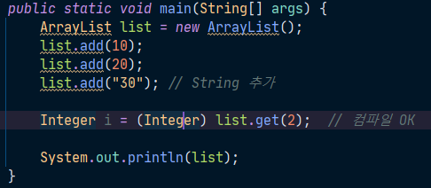
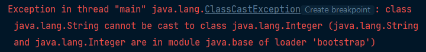
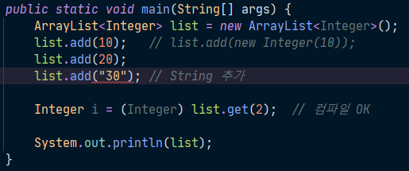
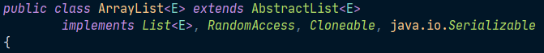
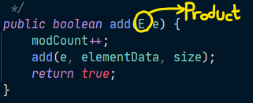
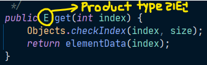
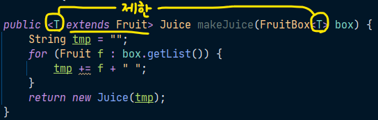

# 14주차 과제: 제네릭

### 목표

자바의 제네릭에 대해 학습하세요.

### 학습할 것 (필수)

- 제네릭 사용법
- 제네릭 주요 개념 (바운디드 타입, 와일드 카드)
- 제네릭 메소드 만들기
- Erasure


## Generics

컴파일러에게 타입 정보를 제공함으로써, 컴파일시 타입을 체크해주는 기능이며 JDK 1.5부터 도입되었다.

제네릭은 객체의 **타입 안정성**을 높이고 **형변환 생략이 가능**해 코드가 간결해지는 장점을 갖고 있다.

면밀히 말하자면, 제네릭은 런타임 에러인 ``ClassCastException`` (형변환에러) 예외를 컴파일 에러로 잡아내고자 고안된 기능이다. 다음 코드를 보자.



정수를 추가할 list를 하나 만들었다고 하자. 그런데, 실수로 정수가 아닌 ``String``을 추가하게 되었다. 

당연히 정수가 들어있을 줄 알고 list에서 요소를 꺼내 ``Integer`` 타입으로 형변환을 시도한다고 하면 다음과 같은 런타임 에러인 ``ClassCastException`` 을 맞이하게 되는 것이다.



컴파일러는 당연히 ``list.get()``을 호출하면 반환하는 타입이 ``Object``이기 때문에 ``Object`` 타입을 ``Integer``로 변환하는 것이 문제가 되지 않기 때문에 에러로 잡지 않는다.

하지만 실제로 들어있는 것은 ``String``타입이기 때문에 형변환 에러가 발생하는 것이다.

제네릭을 사용하여 이전의 코드를 다음과 같이 수정하였다.



list에 들어갈 요소의 타입을 맨 윗줄의 코드와 같이 ``Integer``로 지정해주면 실수로 ``String``을 추가하게 되더라도 컴파일러가 체크해주는 것을 확인할 수 있다. 

또한 list의 타입을 알고 있기 때문에 ``list.get()``을 할 때 형변환 생략이 가능하여 다음과 같이 바꿔서 쓸 수 있다.

```java
// Integer i = (Integer) list.get(2); 
Integer i = list.get(2);
```


### 타입 변수

제네릭 클래스를 작성할 때, 일반 클래스의 ``Object``타입 대신 타입 변수(E)를 선언해서 사용

통상적으로 대문자 한글자를 사용하며, 보통 Type을 의미하는 T나 Element의 E를 주로 사용한다.



객체를 생성할 때, 타입 변수(E) 대신 실제 타입을 지정해줘야 한다. 타입 변수의 타입은 참조변수와 생성자에 넣어줘야 하며, 이 둘의 타입이 일치해야 한다. 

```java
ArrayList<Integer> list = new ArrayList<Integer>();
```

JDK 1.7부터는 생성자에 타입을 지정하는 것을 생략할 수 있어 다음과 같이 쓸 수 있다.

```java
ArrayList<Integer> list = new ArrayList<>();
```


제네릭 용어

Box<T> 제네릭 클래스

T : 타입 변수 또는 타입 매개변수

Box 원시타입(raw type): 일반클래스


### 제네릭 타입과 다형성

다음과 같은 관계를 가진 클래스가 선언되어 있다고 가정하자.

```java
class Product {}
class Tv extends Product {}
class Audio extends Product {}
```

- 참조 변수와 생성자의 대입된 타입은 일치해야 한다.

  ```java
  ArrayList<Tv> list = new ArrayList<Tv>();
  ArrayList<Product> list = new ArrayList<Tv>(); // 에러 발생(불일치)
  ```

- 제네릭 클래스간의 다형성은 성립한다. (but, 대입된 타입은 일치해야 함)

  ```java
  List<Tv> list = new ArrayList<Tv>();	// ArrayList가 List를 구현
  List<Tv> list = new LinkedList<Tv>();	// LinkedList가 List를 구현
  ```

- 매개변수의 다형성도 성립가능 하다.

  ```java
  ArrayList<Product> list = new ArrayList<Product>();
  list.add(new Product());
  list.add(new Tv());		// 가능 (다형성)
  list.add(new Audio());	// 가능 (다형성)
  
  Product p = list.get(0);
  Tv tv = (Tv)list.get(1);	// 타입 불일치로 형변환 필요
  ```

  | ``boolean add(E e)``                                         | ``E get(int index)``                                         |
  | ------------------------------------------------------------ | ------------------------------------------------------------ |
  |  |  |


### 제네릭 타입 제한

- ``extends``로 대입할 수 있는 타입을 제한

  ```java
  class Fruit {}
  class Apple extends Fruit {}
  
  class FruitBox<T extends Fruit> {}
  
  FruitBox<Apple> appleBox = new FruitBox<Apple>(); // 가능
  FruitBox<Toy> toyBox = new FruitBox<Toy>(); 	// 불가능
  ```

- 인터페이스인 경우에도 ``extends``를 사용 (``implements``를 사용하지 않는다)

  ```java
  interface Eatable {}
  class FruitBox<T extends Eatable> {}
  ```

- 인터페이스와 클래스를 같이 쓸 때에는 ``&``연산자를 사용 ( ``,`` 연산자를 사용하지 않는다)

  ```java
  class FruitBox<T extends Fruit & Eatable> {}
  ```


### 제네릭의 제약

- 타입 변수에 대입은 인스턴스 별로 다르게 할 수 있다.

- 위의 조건에 의해, ``static``멤버에 타입 변수를 사용할 수 없다.

  ```java
  class Box<T>{
      static T item;	// 에러
      static int compare(T t1, T t2) {}	// 에러
  }
  ```

- 배열 또는 객체를 생성할 때 타입 변수를 사용할 수 없다. 타입 변수로 배열 선언은 가능하다.
  쉽게 말해서 ``new``연산자 다음에 타입변수 T가 올 수 없다.

  ```java
  class Box<T>{
      T[] itemArr;	// 가능, T타입의 배열을 위한 참조변수
      T[] toArray(){
          T[] tmpArr = new T[itemArr.length];	// 에러, 제네릭 배열 생성 불가
      }
  }
  ```

  

### 와일드 카드

다형성과 같이 하나의 참조 변수로 대입된 타입이 다른 객체를 참조 가능하다. 

| 종류              | 설명                                                   |
| ----------------- | ------------------------------------------------------ |
| ``<? extends T>`` | 와일드 카드의 상한 제한. T와 그 자손들만 가능          |
| ``<? super T>``   | 와일드 카드의 하한 제한. T와 그 조상들만 가능          |
| ``<?>``           | 제한 없음. 모든 타입이 가능. <? extends Object>와 동일 |

메서드의 매개변수에도 와일드 카드를 사용할 수 있다.

```java
static Juice makeJuice(FruitBox<? extends Fruit> box){
    ...
}
```


### 제네릭 메서드

제네릭 타입이 선언된 메서드(타입 변수는 메서드 내에서만 유효), 메서드 레벨에서 타입 변수가 선언된 것을 의미한다.

```java
static <T> void sort(List<T> list, Comparator<? super T> c)
```

클래스의 타입 매개변수<T>와 메서드의 타입 매개변수 <T>는 별개다.

제네릭 클래스 내에 제네렉 메서드가 선언될 수 있으며, 각각의 타입 문자의 선언은 <T>로 동일하나, 다른 타입 변수다. 그리고 일반적으로 같은 이름으로 선언된 인스턴스 변수와 지역변수가 있을 때 메서드 내에서는 인스턴스 변수보다 지역변수가 우선순위를 가지듯, 제네릭 메서드 에서는 메서드에서 선언된 타입 변수가 우선한다. 

그래서 클래스의 타입 매개변수와 메서드의 타입 매개변수는 다른 값을 가질 수 있다.

```java
class FruitBox<T>{
    static <T> void sort(List<T> list, Comparator<? super T> c) {}
}
```

제네릭 메서드는 메서드를 호출할 때마다 타입을 대입해야하지만 대부분 생략이 가능하다. 

다음과 같은 제네릭 메서드가 선언되어 있다고 가정할 때, 



```java
FruitBox<Fruit> fruitBox = new FruitBox<Fruit>();
FruitBox<Apple> appleBox = new FruitBox<Apple>();

System.out.println(Juicer.<Fruit>makeJuice(fruitBox));
// == System.out.println(Juicer.makeJuice(fruitBox));
System.out.println(Juicer.<Apple>makeJuice(appleBox));
// System.out.println(Juicer.makeJuice(appleBox));
```

앞에 인스턴스를 선언할 때 제네릭 타입을 지정해주었기 때문에 메서드를 호출할 때 앞에 타입을 생략해서 제네릭 메서드를 호출할 수 있다.

하지만 메서드를 호출할 때 타입을 생략하지 않을 경우에는 클래스 이름 생략이 불가능 하다.

그리고 위의 제네릭 메서드는 다음과 같이 와일드 카드를 사용한 메서드로 선언해서 대체하여 사용이 가능하다.

```java
static Juice makeJuice(FruitBox<? extends Fruit> box){
    String tmp = "";
            for (Fruit f : box.getList()) {
                tmp += f + " ";
            }
            return new Juice(tmp);
}
```

하지만 이 두 메서드는 전혀 다르다. 와일드 카드는 하나의 참조변수로 서로 다른 타입이 대입된 여러 제네릭 객체를 다루기 위한 것이고, 제네릭 메서드는 메서드를 호출할 때마다 다른 제네릭 타입을 대입할 수 있게 한 것으로 서로 다르다는 점을 명심해야 한다.


### Reference URL

> https://www.youtube.com/channel/UC1IsspG2U_SYK8tZoRsyvfg