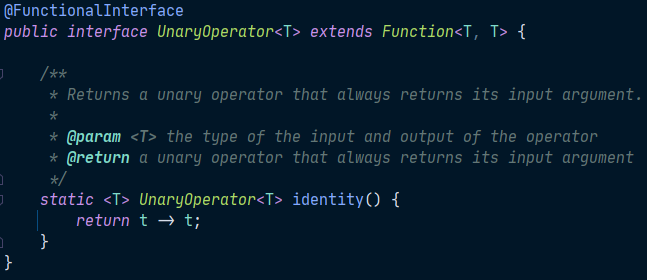

# 15주차 과제: 람다식

### 목표

자바의 람다식에 대해 학습하세요.

### 학습할 것 (필수)

- 람다식 사용법
- 함수형 인터페이스
- Variable Capture
- 메소드, 생성자 레퍼런스


## 람다식 (Lambda Expression)

함수(메서드)를 간단한 식(expression)으로 표현하는 방법

반환타입과 이름을 지우기 때문에 익명함수(이름이 없는 함수, anonymous function)라고도 한다.

```java
int max(int a, int b) {
    return a > b ? a : b;
}
```

와 같은 메서드가 있다고 가정할 때, 다음과 같은 람다식으로 바꿔서 표현할 수 있다.

```java
(a, b) -> a > b ? a : b
    또는
(int a, int b) -> {
    return a > b ? a : b;
}
```

**함수와 메서드의 차이**

- 근본적으로 동일하지만 함수는 일반적 용어, 메서드는 객체지향개념 용어
- 함수는 클래스에 독립적, 메서드는 클래스에 종속적


### 람다식 작성방법

1. 메서드의 이름과 반환타입을 제거하고 ``->``를 ``{}`` 블록 앞에 추가한다.

   ```java
   (int a, int b) -> {
       return a > b ? a : b;
   }
   ```

2. 반환값이 있는 경우, 식이나 값만 적고 ``return``문 생략 가능 (끝에 ``;`` 또한 생략)

   ```java
   (int a, int b) -> a > b ? a : b
   ```

3. 매개변수의 타입이 추론 가능하면 생략 가능(대부분의 경우 생략할 수 있다)

   ```java
   (a, b) -> a > b ? a : b
   ```


### 람다식 작성시 주의사항

1. 매개변수가 하나인 경우, ``()``괄호 생략 가능 (단, 타입이 없을 때만)

   ```java
   	a -> a * a	// 가능
   int a -> a * a	// 불가능. (int a)로 고쳐 써야함
   ```

2. 블록 안의 문장이 하나뿐 일 때, ``{}``괄호 생략 가능(끝에 ``;`` 도 생략해야 함)

   ```java
   (int i) -> {
       System.out.println(i);
   }
   ```

   ```java
   (int i) -> System.out.println(i)
   ```

   단, 하나뿐인 문장이 ``return``문이면 ``{}``괄호 생략 불가

   ```java
   (int a, int b) -> return a > b ? a : b		// 에러
   (int a, int b) -> { return a > b ? a : b; }	// OK
   ```

   

사실 람다식은 익명함수가 아닌 **익명 객체**다.

다음과 같은 람다식이 있다고 가정하면,

```java
(a, b) -> a > b ? a : b
```

다음과 같이 풀어서 표현할 수 있다.

```java
new Object() {
    int max(int a, int b){
        return a > b ? a : b;
    }
}
```

자바에서 메서드는 클래스에 종속적이기 때문에 메서드 자체를 독립적으로 사용할 수 없기 때문이다.

결국 객체를 다루기 위해선 참조변수가 필요한데, 그렇다면 익명 객체인 람다식을 다루기 위해서 필요한 참조변수의 타입은 무엇일까? 다음 코드를 살펴보자.

```java
Object obj = new Object() {
    int max(int a, int b){
        return a > b ? a : b;
    }
};
int value = obj.max(3, 5);	// 에러 발생, Object 클래스에 max()가 없음
```

``int max()``라는 메서드를 ``Object`` 클래스에는 ``max()``라는 함수가 선언되어있지 않기 때문에 ``obj``라는 참조변수를 사용해서 접근할 시 오류가 발생하게 된다. 그렇다면 람다식을 어떻게 다뤄야 할까?


## 함수형 인터페이스

앞선 예시의 의문에 대한 답은 함수형 인터페이스다. 

함수형 인터페이스란 단 하나의 추상 메서드만 선언된 인터페이스로 람다식을 다루기 위한 참조변수의 타입으로 사용한다.

```java
@FunctionalInterface
interface MyFunction {
    public abstract int max(int a, int b);
}
```

위와 같이 함수형 인터페이스가 선언되어있을 경우에는, 람다식을 다음과 같이 사용할 수 있게 된다.

```java
MyFunction f = new MyFunction() {
    public int max(int a, int b){
        return a > b ? a : b;
    }
};
int value = f.max(3,5);
```

다형성으로 인해 함수형 인터페이스 타입의 참조변수로 람다식을 참조할 수 있다.

```java
MyFunction f = (a, b) -> a > b ? a : b;
int value = f.max(3,5);
```

당연한 이야기지만, 함수형 인터페이스에 선언된 메서드의 매개변수 타입, 리턴타입은 람다식에서 사용하는 매개변수, 리턴 타입과 같아야 한다.


아래 코드와 같이 함수형 인터페이스를 이용하면 메서드의 매개변수로 람다식을 받을 수 있으며, 메서드의 반환 타입으로도 함수형 인터페이스를 적어서 람다식을 반환할 수 있다. 

```java
@FunctionalInterface
interface MyFunction { 
	void run();
}

class lambdaTest {
    static void execute(MyFunction f){	// 매개변수의 타입이 MyFunction인 메서드
        f.run();
    }
    static MyFunction getMyFunction(){	// 반환 타입이 MyFunction인 메서드
        return () -> System.out.println("f3.run()");
    }
    
    public static void main(String args[]){
        // 람다식으로 MyFunction의 run()을 구현
        MyFunction f1 = () -> System.out.println("f1.run()"); 
        
        // 익명 클래스로 run() 구현
        MyFunction f2 = new MyFunction(){
            public void run(){
                System.out.println("f2.run()");
            }
        };
        
        MyFunction f3 = getMyFunction();
        
        f1.run();
        f2.run();
        f3.run();
        
        execute(f1);
        execute(() -> System.out.println("run()"));
    }
}
```


코드의 실행결과는 다음과 같다.

```
f1.run()
f2.run()
f3.run()
f1.run()
run()
```


### java.util.function 패키지

자바는 자주 사용되는 다양한 함수형 인터페이스를 제공하고 있으며, 함수형 인터페이스의 표준화로 인해 사용자가 이해하기 쉽고 편리하게 사용할 수 있다는 장점이 있다.

#### 자주 사용하는 함수형 인터페이스

| 함수형 인터페이스  | 메서드                | 설명                                                         |
| ------------------ | --------------------- | ------------------------------------------------------------ |
| java.lang.Runnable | ``void run()``        | 매개변수도 없고, 반환값도 없음                               |
| Supplier<T>        | ``T get()``           | 매개변수는 없고, 반환값만 있음                               |
| Consumer<T>        | ``void accept(T t)``  | 매개변수만 있고, 반환값이 없음(Supplier와 반대)              |
| Function<T, R>     | ``R apply(T t)``      | 일반적인 함수, 하나의 매개변수를 받아서 결과를 반환          |
| Predicate<T>       | ``boolean test(T t)`` | 매개변수는 하나, 반환 타입은 boolean<br />조건식을 표현하는데 사용됨. |

함수형 인터페이스 중 하나인 Predicate를 사용한 예시는 다음과 같다.

```java
Predicate<String> isEmptyStr = s -> s.length()==0;
String s = "";

if (isEmptyStr.test(s))		// == if(s.length() == 0)
    System.out.println("This is an empty String.");
```

#### 매개변수가 2개인 함수형 인터페이스

매개변수가 2개임을 표시하기 위하여 기존 인터페이스 앞에 ``Bi``(Binary)가 붙는다.

| 함수형 인터페이스 | 메서드                     | 설명                                         |
| ----------------- | -------------------------- | -------------------------------------------- |
| BiCunsumer<T, U>  | ``void accept(T t, U u)``  | 두 개의 매개변수만 있고, 반환값이 없음       |
| BiPredicate<T, U> | ``boolean test(T t, U u)`` | 두 개의 매개변수가 있고, 반환값은 boolean    |
| BiFunction<T,U,R> | ``R apply(T t, U u)``      | 두 개의 매개변수를 받아서 하나의 결과를 반환 |

매개변수가 3개인 함수형 인터페이스는 자바에서 제공하고 있지 않기 때문에 필요한 경우에는 다음과 같이 함수형 인터페이스를 선언하여 사용하면 된다.

```java
@FunctionalInterface
interface TriFunction<T, U, V, R>{
    R apply(T t, U u, R r);
}
```

#### 매개변수의 타입과 반환타입이 일치하는 함수형 인터페이스

| 함수형 인터페이스 | 메서드                | 설명                                                         |
| ----------------- | --------------------- | ------------------------------------------------------------ |
| UnaryOperator<T>  | ``T apply(T t)``      | Function의 자손, <br />Function과 달리 매개변수와 결과의 타입이 같다. |
| BinaryOperator<T> | ``T apply(T t, T t)`` | BiFunction의 자손,<br />BiFunction과 달리 매개변수와 결과의 타입이 같다. |




```java
public class LambdaTest {
    public static void main(String[] args) {
        Supplier<Integer> supplier = () -> (int)(Math.random()*100)+1;  // 1~100 난수
        Consumer<Integer> consumer = i -> System.out.println(i + ", "); // i 출력
        Predicate<Integer> predicate = i -> i%2==0;     // 짝수인지 검사
        Function<Integer, Integer> function = i -> i/10*10;     // i의 일의 자리를 없앰

        List<Integer> list = new ArrayList<>();
        makeRandomList(supplier, list);
        System.out.println(list);

        printEvenNum(predicate, consumer, list);

        List<Integer> newList = makeNewList(function, list);
        System.out.println(newList);
    }

    /* function의 식을 이용해 기존 list 내 요소의 일의 자리를 없애 새로운 list 생성 */
    static <T> List<T> makeNewList(Function<T, T> function, List<T> list) {
        List<T> newList = new ArrayList<>(list.size());

        for (T i : list) {
            newList.add(function.apply(i));
        }
        return newList;
    }

    /* predicate로 list 내 짝수인 수만 출력 */
    static <T> void printEvenNum(Predicate<T> predicate,
                             Consumer<T> consumer, List<T> list) {
        System.out.println("[");
        for (T i : list) {
            if (predicate.test(i)) {
                consumer.accept(i);
            }
        }
        System.out.println("]");
    }

    /* supplier로 부터 1~100의 난수를 받아 list에 추가 */
    static <T> void makeRandomList(Supplier<T> supplier, List<T> list) {
        for (int i = 0; i < 10; i++) {
            list.add(supplier.get());
        }
    }
}
```

예제의 실행 결과는 다음과 같다.

````
[28, 93, 51, 50, 70, 4, 16, 77, 10, 4]
[28, 50, 70, 4, 16, 10, 4, ]
[20, 90, 50, 50, 70, 0, 10, 70, 10, 0]
````


### Interface Predicate<T>의 메서드

Predicate 함수형 인터페이스는 두 Predicate를 하나로 결합시키는 여러 메소드를 제공한다.

| 접근 제어자 | 메서드 명     | 역할        |
| ----------- | ------------- | ----------- |
| default     | ``and()``     | ``&&``(and) |
| default     | ``or()``      | ``||``(or)  |
| default     | ``negate()``  | ``!``(not)  |
| static      | ``isEqual()`` | 등가비교    |

위의 메소드를 활용한 예시를 살펴보자.

```java
Predicate<Integer> p = i -> i < 100;
Predicate<Integer> q = i -> i < 200;
Predicate<Integer> r = i -> i%2 == 0;

Predicate<Integer> notP = p.negate();		// i >= 100
Predicate<Integer> all = notP.and(q).or(r);	// i >= 100 && i < 200 || i%2==0

System.out.println(all.test(2));	// true 출력
```

``all.test(2)``를 실행하면 메소드들에 의해 결합된 predicate식에 2가 대입되어 결합된 조건식을 거친 뒤 boolean 값을 반환하게 된다.

``notP.and(q).or(r)`` 을 풀어서 표현하면 ``i >= 100 && i < 200 || i%2==0`` 과 같이 쓸 수 있으며 조건식의 결과는 ``false && true || true `` 로 최종적으로 ``true``를 반환하는 것을 확인할 수 있다.

등가비교를 위한 Predicate의 작성에는 ``isEqual()``를 사용하며, 사용 예시는 다음과 같다.

```java
String str1 = "abc";
String str2 = "abc";

Predicate<String> p = Predicate.isEqual(str1);	// static 메서드
Boolean result = p.test(str2);		// str1과 str2가 같은지 비교한 결과를 반환

// str1.equals(str2)와 같다
Boolean result2 = Predicate.isEqual(str1).test(str2);	// 위의 코드 두줄과 같음
```


### 컬렉션 프레임워크와 함수형 인터페이스

JDK 1.8부터 함수형 인터페이스를 사용해 컬렉션 프레임워크를 좀 더 편리하게 사용할 수 있게 되었다. 각 컬렉션별로 유용하게 사용할 수 있는 메서드들 몇 가지를 알아보자.

| 인터페이스 | 메서드(와일드카드 생략)                            | 설명                             |
| ---------- | -------------------------------------------------- | -------------------------------- |
| Collection | ``boolean removeIf(Predicate<E> filter)``          | 조건에 맞는 요소를 삭제          |
| List       | ``void replaceAll(UnaryOperator<E> operator)``     | 모든 요소를 변환하여 대체        |
| Iterable   | ``void forEach(Consumer<T> action)``               | 모든 요소에 작업 action을 수행   |
| Map        | ``V compute(K key, BiFunction<K,V,V> f)``          | 지정된 키의 값에 작업 f를 수행   |
|            | ``V computeIfAbsent(K key, Function<K,V> f)``      | 키가 없으면, 작업 f 수행 후 추가 |
|            | ``V computeIfPresent(K key, BiFunction<K,V,V> f)`` | 지정된 키가 있을 때, 작업 f 수행 |
|            | ``V merge(K key, V value, BiFunction<V,V,V> f)``   | 모든 요소에 병합작업 f를 수행    |
|            | ``void forEach(BiConsumer<K,V> action)``           | 모든 요소에 작업 action을 수행   |
|            | ``void replaceAll(BiFunction<K,V,V> f)``           | 모든 요소에 치환작업 f를 수행    |

메서드를 활용한 예시는 다음과 같다.

```java
public class LambdaTest2 {
    public static void main(String[] args) {
        List<Integer> list = new ArrayList<>();
        for (int i = 0; i < 10; i++) {
            list.add(i);
        }

        /* list의 모든 요소를 출력 */
        list.forEach(i -> System.out.println(i+", "));
        System.out.println("==========");

        /* list에서 2 또는 3의 배수를 제거 */
        list.removeIf(i -> i%2==0 || i%3==0);
        System.out.println(list);

        /* list의 각 요소에 10을 곱함 */
        list.replaceAll(i -> i*10);
        System.out.println(list);

        Map<String, Integer> map = new HashMap<>();
        map.put("1", 1);
        map.put("2", 2);
        map.put("3", 3);
        map.put("4", 4);

        /* map의 모든 요소를 {k, v}의 형식으로 출력 */
        map.forEach((k, v) -> System.out.println("{"+k+", "+v+"}, "));
    }
}
```

```
0, 1, 2, 3, 4, 5, 6, 7, 8, 9, 
==========
[1, 5, 7]
[10, 50, 70]
{1, 1}, {2, 2}, {3, 3}, {4, 4}, 
```


## 메서드 참조(Method reference)

메서드 참조란 람다식을 더 간단하게 표현한 것으로 ``클래스이름::메서드이름``의 형태로 사용할 수 있다.

| 종류                 | 람다                       | 메서드 참조         |
| -------------------- | -------------------------- | ------------------- |
| static 메서드 참조   | (x) -> ClassName.method(x) | ClassName::method() |
| 인스턴스 메서드 참조 | (obj, x) -> obj.method(x)  | ClassName::method() |

String 타입의 정수를 Integer로 변환해주는 람다식을 선언했다고 가정하자.

```java
Function<String, Integer> f = (String s) -> Integer.parseInt(s);
System.out.println(f.apply(100)+200);	// 300
```

메서드의 매개변수(입력값) 타입은 참조변수의 제네릭 타입으로 String을 지정해준 부분을 통해 알 수 있기 때문에 ``(String s)`` 부분이 생략이 가능하게 된다. 

또하느 ``parseInt()`` 메서드의 매개변수가 몇 개 필요한지는 컴파일러가 알고 있기 때문에 해당 부분도 생략할 수 있게 되어 위의 코드는 다음과 같이 줄여 쓸 수 있게 된다.

```java
Function<String, Integer> f = Integer::parseInt;
System.out.println(f.apply(100)+200);	// 300
```


### 생성자의 메서드 참조

메서드의 이름 대신 ``new``연산자를 이용하여 ``클래스이름::new``의 형태로 사용한다.

- 매개변수가 없는 경우

  ```java
  Supplier<MyClass> s = () -> new MyClass();
  ```

   	🔻

  ```java
  Supplier<MyClass> s = MyClass::new;
  ```

- 매개변수가 1개 있는 경우

  ```java
  Function<Integer, MyClass> f = (i) -> new MyClass(i);
  ```

   	🔻 

  ```java
  Function<Integer, MyClass> f = MyClass::new;
  ```

- 배열을 생성하는 경우

  ```java
  Function<Integer, int[]> f = x -> new int[x];
  ```

   	🔻 

  ```java
  Function<Integer, int[]> f = int[]:;new;
  ```

  


### Reference URL

> https://www.youtube.com/playlist?list=PLW2UjW795-f6xWA2_MUhEVgPauhGl3xIp